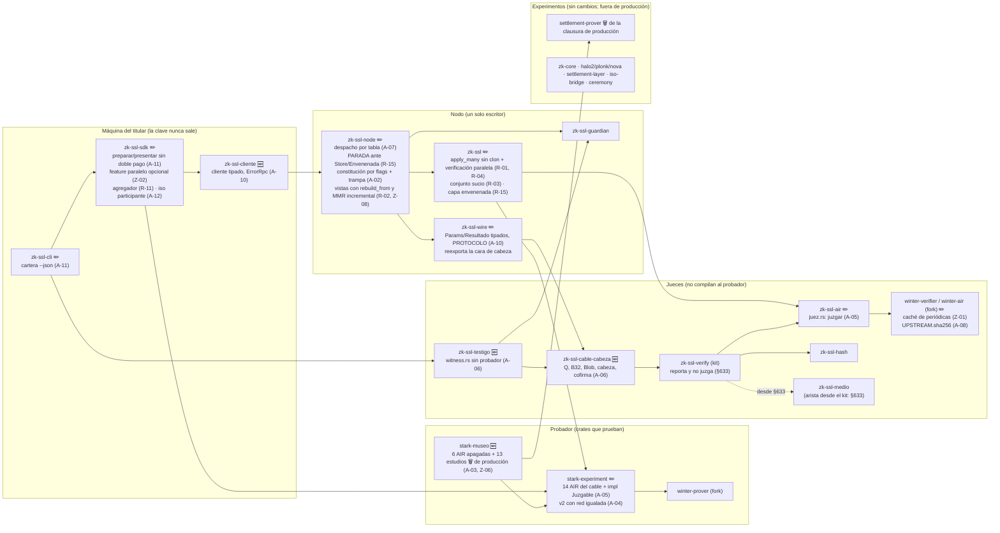

# Arqueo Architecture Blueprint v2.0 — informe del segundo enjambre (versión pública)

| | |
|---|---|
| **Fecha** | 2026-10-01 |
| **Estado** | **PROPUESTA, no implementada, pendiente de decisión del autor.** Nada de lo que sigue está construido en el árbol. |
| **Quién la produjo** | Un enjambre de agentes de Claude Code orquestado en una sesión en la nube: cuatro especialistas (Criptógrafo & ZK, Rendimiento & Estructuras de datos, Seguridad, Arquitectura & API), seis contrainterrogatorios cruzados, un equipo de mediciones y verificadores de evidencia y de compatibilidad. **No lo escribió el autor en su máquina**, y queda fuera del paso 4 de `GENAI.md`. Es el **segundo enjambre independiente** sobre el mismo encargo, después del §637: trabajó sin ver al otro, y el §7 compara los dos. |
| **Base y comprobación** | El enjambre **leyó `7d13f26`** (§631). Las **mediciones dirimentes corrieron sobre `f7aad05`** (§635), en un worktree aislado donde el código medido es idéntico al de `7d13f26` (§1). Este documento **se comprobó sobre `e1d1db3`** (§642, `origin/main`): las rutas y funciones que cita existen allí (`ls`, `grep`), y los números de línea de los ficheros que cambiaron después de la base (`zk-ssl-node/src/main.rs`, `tools/canon.sh`, `doc/ESCALADO.md`, `README.md`, `BACKLOG.md`) están puestos al día con `e1d1db3`. |
| **Lo que `main` ganó desde la base** | §632-§635: RFC-0013 E2b, E4a y E4b, y el juez del umbral del medio. El §633 decide, por el autor, que **el kit reporta y no juzga**; el §635 pone ese juez en `crates/zk-ssl-cli/src/medio.rs` (+57 líneas en `witness.rs`); la clausura del kit sube de 48 a 61 paquetes (entran `zk-ssl-medio` y `ml-dsa`) `[medido-hoy: cargo tree, Anexo A.4]`. **§636-§642, la cabeza y el firmante**: el §636 corrige la firma a demanda que no existe y hace que el diario diga de qué clave es cada línea, el §638 precisa su alcance, y el RFC-0015 (el ciclo de vida del firmante) nace PROPUESTO en el §639 con sus cinco decisiones tomadas en el §642. Ninguno de los §636-§642 toca dependencias: `Cargo.lock` es el mismo que en `f7aad05`. |
| **Fuera de `main`** | El blueprint del §637, con el que compara el §7, todavía no está en `main`. Este documento no se apoya en nada que no esté en `main`. |
| **Seguridad** | **16 hallazgos de seguridad abiertos en `main` (2 P0, 6 P1, 7 P2, 1 P3), en embargo según `SECURITY.md` §5, entregados al autor fuera del árbol.** Este documento no los describe (§2.3). |
| **Snippets** | Los cuatro del §4.4 compilan con `cargo check` en un worktree desechable de `7d13f26`, con los cuerpos que cada uno declara como `todo!()` o no compilados; ninguno se ha ejecutado ni testeado. Los snippets del expediente que tocan hallazgos en embargo no se publican. |
| **Repositorio** | Intacto. Todas las mediciones se hicieron sobre binarios ya compilados o con ejemplos temporales que se borraron después (`git status --porcelain -uall` vacío). |

**Cómo leer la procedencia de las cifras.** Cada número lleva una etiqueta:

- `[medido-hoy: …]`: medido en esta sesión, en la máquina del §1, con el banco o el comando que se cita (Anexo A). Los ficheros crudos no se versionan; el Anexo A transcribe lo esencial.
- `[AUDITORIA §N]`: cifra del registro, tal como quedó asentada. **No** es una medida de hoy.
- `[estimado: …]`: proyección, con su derivación al lado. No es un hecho.
- `[supuesto]`: hipótesis sin medir.
- `[leído: fichero:línea]`: afirmación sobre el código, leída en `7d13f26` y comprobada en `e1d1db3`.

**Glosario mínimo.**

- **Lentes** (fase 1): cada especialista trabajó con dos lentes. C1/C2 = Criptógrafo & ZK; P1/P2 = Rendimiento; S1/S2 = Seguridad; A1/A2 = Arquitectura.
- **Identificadores de las propuestas**: reasignados para esta versión pública, por especialidad: **Z** (criptografía y ZK), **R** (rendimiento y estructuras), **S** (seguridad), **A** (arquitectura e integración). Los hallazgos en embargo se cuentan como **E-1 a E-16**. Ninguno de estos números corresponde a los del expediente; la correspondencia la tiene el autor.
- **D1-D6**: los seis contrainterrogatorios cruzados de la fase 2; cada uno atacó las propuestas de otra especialidad y aportó objeciones o sondas. Aquí se citan solo como procedencia («objetó D4»).
- **MD-1 a MD-5**: las mediciones dirimentes publicables (§3.2).
- **C2 y C7 de ESCALADO** (no confundir con la lente C2): los cortes de `doc/ESCALADO.md`. **C2** = nonce en la hoja del pagador (ESCALADO.md:205); **C7** = particionado por prefijo de `account_id`, es decir, sharding (ESCALADO.md:247). En este informe se escriben siempre «C2 de ESCALADO» y «C7 de ESCALADO».
- **K1-K3**: los tres cortes en que se partió la propuesta de vías delegadas (K1 = reembolso y destrucción por el cable, A-09; K2 = A-17; K3 = A-18).
- **2T**: la ocultación de RFC-0009 añade T filas aleatorias a una traza de T filas, así que la longitud L se dobla.
- **42/16/21**: las opciones de prueba de producción: 42 consultas, blowup 16 y 21 bits de molienda (`crates/zk-ssl/src/lib.rs:216-227`).
- **Molienda** (grinding): la prueba de trabajo de Fiat-Shamir; su número de intentos es aleatorio y causa la cola larga al generar.
- **Holgura**: las filas de la traza que el circuito no usa (en `circuit_send`, 208; `circuit_send.rs:99-105`).
- **D-J, D-Z, D-I…**: decisiones con nombre dentro de un RFC (p. ej. RFC-0009 D-J fija el coste medido de ocultar).
- **Pago / operación**: un pago son **2 operaciones** (envío y cobro), cada una con su prueba. «op/s» cuenta operaciones; «pagos/s», pagos. La misión de 3,3 tx/s (ESCALADO.md:291) se lee aquí como 3,3 pagos/s `[supuesto: tx = pago]`.

> ⚠️ El encargo que originó este informe se escribió **sin leer el árbol**: habla de Go/C++, Pedersen, Bulletproofs, GPU, «millones de pruebas por segundo» y un «motor intercambiable». El valor de este documento es contrastarlo con el árbol real. Donde el encargo apunta a algo que aquí no existe, ya está resuelto o contradice una decisión medida, se dice con la evidencia, como hizo `doc/DIAGNOSTICO_ESCALADO.md`.

---

## 0. Resumen ejecutivo

**Cómo está organizado el plan.** Seis tramos (§4.3): **0** testigos, compuertas y verdad escrita, sin cambiar conducta; **1-2** cerrar los hallazgos en embargo, fuera de este documento, junto con la capa envenenada (R-15) y la constitución por flags (A-02); **3** rendimiento sin cambio de formato; **4** modularidad e integración (métodos aditivos); **5** el tren `zkssl/0.5`, la única ruptura de cable; **6** condicionadas por la misión o por el autor. **Decisiones del autor que bloquean**: §6.3 punto 2 (constitución de producción, olas 1-2), y las que piden los hallazgos en embargo, que van con ellos.

1. **Lo más importante no es de rendimiento.** El enjambre registró **16 hallazgos de seguridad abiertos en `main` (2 P0, 6 P1, 7 P2, 1 P3)**, en embargo según `SECURITY.md` §5 y entregados al autor fuera del árbol. Este documento no los describe; las olas 1-2 los cierran.
2. **Hoy aplicar cuesta 5,6-6,0 ms por operación y verificar es el 74 % de eso** (4,30 ms) `[medido-hoy]`. En el registro eran 3,67 ms y 2,35 ms (§219, §89.1). El techo del nodo es 145 op/s en lote, no 248 (§229), y unas 101-122 op/s en secuencial (8,22-9,90 ms por petición de una operación) `[medido-hoy: H.1, n = 1, dos corridas]`. Lo más probable es que la diferencia venga de la ocultación de §538 (×1,9 al verificar, RFC-0009 D-J); no se ha hecho bisección.
3. **Generar sigue mandando: es el 96 % del ciclo y usa un solo núcleo.** La molienda explica el 99 % de la dispersión `[medido-hoy: r² = 0,993]`. Con `winterfell/concurrent`, generar cuesta ×1,64-1,86 menos en 4 núcleos, pero un 10-14 % más con 1 núcleo `[medido-hoy: MD-3, con la feature unificada en zk-ssl; la configuración propuesta, solo en el SDK, no está medida]`. Ocultar dentro de la holgura (Z-05) podría bajarlo otro 30-50 % `[estimado]`, aunque necesita romper el cable.
4. **El nodo tiene costes que crecen con la edad o con el tamaño, no con la carga:**
   - en el latido, el MMR, 0,95 s al mes y 11,6 s al año por cálculo de la cima `[medido-hoy: MD-5]`;
   - en el latido, el árbol de acuses, 2,2 s con K = 8.700 `[medido-hoy]`;
   - en cada lote, el clon de `apply_many`, 62 ms y 100 MB con 1e5 cuentas `[medido-hoy: MD-5]`.
   Todos tienen arreglo sin cambiar formato: `rebuild_from` (×8,5, la misma raíz `[medido-hoy]`), el MMR incremental con oráculo y quitar el clon.
5. **Lo que NO cambia:** STARK sin ceremonia, la familia poscuántica de hash, un solo escritor sin consenso, el operador que ve los saldos, el cable `zkssl/0.4` y la cabeza v6 en las olas 0-4. Los vectores publicados no se tocan nunca.
6. **¿«Millones de pruebas por segundo»?** No, y no lo pide la misión. Verificar cuesta 4,30 ms, es decir, unas 232 verificaciones por segundo y núcleo `[medido-hoy]`, así que 10^6 pagos/s necesitarían unos 8.600 núcleos solo para verificar `[estimado]`. Cada raíz es serie, con un tope de unas 800-1.300 op/s `[estimado]`. La misión declarada son 3,3 tx/s (§122.2). Pero ojo: hoy la vía suelta del SDK da 0,48-0,53 pagos/s `[medido-hoy: A.5]`, con un techo de ≈ 0,53 pagos/s (≈ 1,06 op/s) `[estimado: 1/T_gen]`; el lote por RPC, 1,53 pagos/s `[medido-hoy: D.2]`. Solo el lote con agregador y N = 13 pasaría la misión: ≈ 4,4 pagos/s `[estimado, nota d del §4.1]`.
7. **¿«Mínimo matemático»?** Las opciones de prueba (42 consultas, blowup 16, 21 bits de molienda) ya están en el mínimo honesto. Lo que sobra es la ocultación que dobla la traza (2T), el resto de FRI y el probador de un hilo. El mínimo de bytes del modelo es unos 66 KB frente a 79 KB `[estimado: modelo de bytes, Anexo A.3]`.
8. **¿«Motor intercambiable»?** El sistema de prueba no: ya se intentó (`settlement-prover`) y las raíces firmadas son Rescue/Goldilocks. Lo que sí se puede intercambiar es el **enunciado** (`Juzgable`/`juzgar`, A-05), y la firma por RFC (BACKLOG 87).

---

## 1. Método y línea base medida

**Máquina** `[medido-hoy: Anexo A.1]`:
- VM KVM con 4 vCPU Intel Xeon @ 2,10 GHz (1 hilo por núcleo, AVX-512, SHA-NI), L2 8 MiB, L3 260 MiB, 15 GiB de RAM sin swap.
- rustc y cargo 1.97.0. `/tmp` en disco y `/dev/shm` en tmpfs.
- CPU en reposo al empezar (load 0,01).
- La línea base duró unos 37 min de reloj (8,5 min de compilación); las mediciones dirimentes, otros 37 min.

> ⚠️ Las mediciones dirimentes se hicieron en un worktree aislado en `f7aad05` (§635). `git diff --stat 7d13f26 f7aad05 -- crates/` solo toca `zk-ssl-cli`, `zk-ssl-medio`, `zk-ssl-verify` (lib.rs y main.rs) y vectores. `zk-ssl`, `stark-experiment`, `winter-*`, `zk-ssl-hash`, `zk-ssl-air` y `zk-ssl-node` son idénticos, así que el código medido es el de `7d13f26`. Entre `f7aad05` y `e1d1db3` cambian, en código, `zk-ssl-node` (`main.rs`, `diario.rs`, `latido.rs`) y `zk-ssl-verify` (§636-§638); las cifras de este informe no se han vuelto a medir sobre `e1d1db3`.

> ⚠️ La máquina de S538/§512 era un i5-1135G7 bajo WSL. Las cifras de tiempo **solo son comparables apareadas** (§131; BACKLOG 68, la deriva del 9 % entre tandas, sin investigar).

**Comandos.** Los binarios se compilaron primero (`cargo build --release -p …`) y después se invocaron directamente (`target/release/examples/<banco>`), porque cada `-p` distinto recompila winter-prover, stark-experiment y zk-ssl (64-90 s) por unificación de features. Detalle en el Anexo A.

### Tabla de la línea base: hoy frente al registro

| Magnitud | Hoy | Registro | Diferencia | ¿Explicada? |
|---|---|---|---|---|
| Generar envío (capa) | mediana 940 ms; mín. 857 `[medido-hoy: muestra §89.1, 5 corridas, más 4 corridas «4 núcleos» del banco taskset]` | mín. 697,9-741,6 ms (S538, metrics.rs:132-137) | +16 % en el mínimo | **No explicada**: máquina distinta (2,1 GHz frente a i5); no hay bisección. |
| Generar cobro (capa) | mediana 857 ms; mín. 804 `[medido-hoy: las mismas 9 corridas que la fila anterior; con solo las 5 de la muestra, la mediana sería 1.171 ms]` | mín. 696,9-715,6 ms (S538) | +13 % en el mínimo | No explicada (igual). |
| Generar sin molienda | 812 ms (778-863) `[derivado de medido-hoy: gen − nonce·86,1 ns, 80 muestras]` | — | — | La molienda es 172 ms de media (17,5 %) y explica el 99 % de la varianza (r² = 0,993). Confirma la hipótesis de §485. |
| Verificar una prueba | 4,32 / 4,29 ms (envío/cobro) `[medido-hoy: el_coste_de_verificar]` | 2,35 ms (§89.1) | +83 % | **Explicada en hipótesis**: ×1,9-2,0 por la ocultación (RFC-0009 D-J/D-Z) da 4,5-4,7 ms. Sin bisección. |
| apply_send en memoria | 5,73 ms (5,62-5,82) `[medido-hoy: A.4]`; 5,90-5,95 a 1e3-1e5 `[medido-hoy: B.3]` | 3,58-3,67 ms (§219); banda 3,1-3,8 (§217) | +62 % | Explicada por la verificación (4,30 de 5,8). Sigue **plano** en número de cuentas (e = 0,00). |
| digest_of_proof | 0,017-0,019 ms `[medido-hoy: A.4]` | 30,99 ms en §204 (Rescue) | 0 % del apply | Arreglado en §209 (Blake3). |
| Persistencia en disco | 0,83 ms de 6,70 (12 %) `[medido-hoy: etapa A]` | 3 % (§204) | ×4 en peso relativo | Parcialmente explicada: el apply ha cambiado de tamaño. |
| Techo del nodo por RPC (H.1) | 144-145 op/s, 6,89-6,93 ms/op, fijo 1,90-3,35 ms/petición `[medido-hoy: H.1]` | 248 op/s, 0,225 + 4,035·n ms (§229) | −42 % | Por operación, explicada por la verificación. El fijo (0,225 → 1,9-3,4 ms) se **estima** debido a dos fsync de recepción posteriores a §229 (§253, §569); no está aislado. |
| D.1, 4 clientes por RPC | 0,49 pagos/s; 4,0 regeneraciones/pago `[medido-hoy: D.1]` | 1,72 ± 0,13; 2,90 (§218) | 0,28× | Explicada por generar 3-4 veces más caro que en §216 (ocultación). |
| D.2, lote por RPC | 1,53 pagos/s `[medido-hoy]` | 4,95 (§222) | 0,31× | Igual. |
| B.1, lote en la capa | 1,56-1,76 pagos/s `[medido-hoy]` | 3,70 (§216) | ~0,45× | Igual. |
| I.1, 4 agregadores | aplica 1 de 4 por ronda; 75 % tirado `[medido-hoy]` | 1 de 4 (§230) | igual | — |
| Árbol a 1e6 hojas | 907 MB RSS, 11.370.185 nodos `[medido-hoy: B.2]` — **primera medida real a 1e6** | proyección ~880 MB, 12,1 M (§217) | +3 % | Dentro de la proyección. |
| set_leaf a 1e6 | 241,7 µs, plano `[medido-hoy]` | 231,7-255,5 µs (§217) | igual | — |
| RSS de la capa a 1e5 | 189 MB `[medido-hoy: B.3]` | 163 MB (§219) | +16 % | No explicada (probablemente los árboles nacidos después: consumos, recepción). |
| Arranque a 1e5 (tmpfs) | 18,80 s `[medido-hoy: B.4]` | 15,70 s (§221) | +20 % | **No explicada.** |
| Tamaño de prueba de envío | 77.100-80.267 B `[medido-hoy]` | banda 73.571-84.244 B (metrics.rs:122-125) | dentro | — |
| Kit, por paquete | 7,35-11,77 ms de mediana por invocación; unos 4-8 ms netos `[medido-hoy: banco del kit, Anexo A.1]` | no hay cifra en AUDITORIA (grep) | — | Primera medida. |

**Fallido:** `etapa_a2_verify` aborta (`ProofDeserializationError`) porque verifica con `MerkleTree<Blake3>`, mientras la capa usa `MerkleConSal<Blake3>` desde S538 (`crates/zk-ssl/examples/etapa_a2_verify.rs:28` frente a `metrics.rs:298`). Compila, así que el canon no lo ve; es el patrón de la nota 111.

**Textos de banco rancios** (no se tocan, pero no hay que creerlos):
- `etapa_b4_arranque.rs:249-257` atribuye el arranque al set_leaf de §207.
- `etapa_a3_escala` dice que «el 93 % es digest_of_proof».
- `d1_rpc_baseline` habla de 65.840 B.
- `etapa_b0_lote` y `h1` imprimen 265-320 op/s como referencia fija.

---

## 2. Fase 1: diagnóstico independiente

### 2.1 Criptógrafo & ZK (lentes C1 y C2)

**Cuellos de botella y limitaciones, por severidad**

| Sev. | Hallazgo | Evidencia |
|---|---|---|
| Alta | **La ocultación dobla L (2T) en los 23 probadores con fila.** Pide como mínimo 44 aberturas cubiertas, pero pone T filas aleatorias. Todo lo proporcional a L se paga doble: el LDE (32.768 filas), los compromisos, DEEP y FRI. Las exenciones pasan de 1 a T+1. | `winter-air/src/air/oculta.rs:57-90`; `winter-prover/src/lib.rs:604-624`; RFC-0009:307-317 (×3,2-3,3 al probar, ×1,9-2,0 al verificar); `circuit_send.rs:99-105` (208 filas de holgura sin usar) |
| Alta | **Verificar es el 74 % del apply** y tiene costes que no dependen de la prueba: 48 columnas periódicas de 1.024 valores se reinterpolan en cada verificación, y hay 1.025 exenciones, cada una con su `exp`. | `winter-verifier/src/evaluator.rs:28-37`; `winter-air/src/air/mod.rs:325-345`; `divisor.rs:53-62` |
| Alta | **Vistas reconstruidas desde cero bajo el candado** (lente C2): acuses y recibos con `set_leaf` hoja a hoja, y el MMR en O(t), en cada latido. | `vista_acuses.rs:37-62`; `vista_recibos.rs:47-66`; `zk-ssl-verify/src/mmr.rs:63-77` |
| Media | **Un solo núcleo** y molienda secuencial con cola larga. Nadie activa la feature `concurrent`. | `winter-prover/Cargo.toml:39-45`; `channel.rs:169-184`; `[medido-hoy: banco taskset]` |
| Media | **La segunda capa de FRI** cuesta 6,5-7,1 KB por prueba, y el resto de grado 255 la evitaría. Nunca se ha explorado. | `crates/zk-ssl/src/lib.rs:221`; `~/.cargo/registry/src/*/winter-fri-0.13.1/src/options.rs:84-92` (fuera del árbol); `[estimado: modelo de bytes, ±1 % frente a la banda]` |
| Media | **La seguridad de producción no está declarada en sus tres cifras.** Medido: 127 conjeturados, UDR 59 y LDR 80 en envío y cobro, con L = 2.048 `[medido-hoy: MD-4, 34 lecturas]`. | `crates/zk-ssl/src/lib.rs:210-227`; `crates/winter-air/src/proof/security.rs:30-46, :150-282`. La decisión «conjeturada frente a demostrable» ya está cerrada (BACKLOG 10, «decidido e implementado»): Z-03 solo añade la declaración, no cambia la decisión. |
| Baja | **Seis AIR que no son de producción** (8.089 líneas: mint, mint_pending, freeze, governance, recovery, threshold_single). La especificación de emisión (`doc/air/circuit_mint.md`, entrada 57) describe el circuito que no corre. | `zk-ssl/src/mint.rs:24-120`; wc -l |
| Baja | **Rescue por inercia** en estructuras que ningún circuito abre, y un registro de dominios que no exige estar libre de prefijos. | grep en `stark-experiment/src`, `zk-ssl-air/src`: 0 ficheros; `tools/check_dominios.py:105-113` |

**Lo que el encargo sugería y aquí no aplica.** Pedersen, Bulletproofs, SNARK con setup, KZG/Verkle, agregación/recursión, GPU para NTT/MSM, bajar consultas o molienda y cambiar el hash interno del STARK: todo en el §5, con su evidencia.

### 2.2 Rendimiento & estructuras de datos (lentes P1 y P2)

| Sev. | Hallazgo | Evidencia |
|---|---|---|
| Alta | **La verificación es el 74 % del apply**, en serie también dentro de `apply_many`. La refutación de §204 A.2 («verificar es el 7 %») ha caducado. | `two_phase.rs:1494-1534`; `[medido-hoy]` |
| Alta | **Componer la cabeza en cada latido cuesta O(historia)**: la vista de acuses se rehace hoja a hoja, con 35 merges por hoja. | `vista_acuses.rs:37-62`; `zk-ssl-verify/src/mmr.rs:63-77` |
| Alta | **Techo estructural de la vía suelta: X ≤ 1/T_gen ≈ 1,06 op/s ≈ 0,53 pagos/s** `[estimado]`, con cualquier número de clientes, porque cada prueba se genera contra la raíz vigente y compite por ella (§230). A.5 lo mide: 0,53 pagos/s con 1 hilo y 0,48 con 4 `[medido-hoy]`. Es la única vía que el SDK ofrece. | `two_phase.rs:937-942, :1254-1258`; `zk-ssl-sdk/src/lib.rs:211-292` |
| Alta | **Techo del lote: X ≤ N/T_ciclo**, con N ≤ 13 por el límite por defecto de axum (no hay `DefaultBodyLimit`). Da unas 8,5-10 op/s, ≈ 4,3-5 pagos/s `[estimado, nota d del §4.1]`. | `zk-ssl-node/src/main.rs:1225`; `spec/RPC.md:31-38`; `[medido-hoy: H.1, el lote de 13 ocupa el 98,3-99,0 % del muro]` |
| Alta | **El registro vive entero en RAM, sin cota**: `LogEntry` = 184 B `[medido-hoy: MD-5, size_of y RSS]`; unos 38 GB al año a la escala de la misión `[estimado: 184 B × 2,1e8]`. | `log.rs:298-300` |
| Media | **`apply_many` clona los árboles de cuentas y pendientes en cada lote**: 62,3 ms y +100 MB a 1e5 cuentas `[medido-hoy: MD-5]`. | `two_phase.rs:1486-1490` |
| Media | **Persistencia**: el lote no es atómico en disco, `commit` no es reintentable y el coste es O(F) en congeladas por operación. | `two_phase.rs:1113, :1379, :1442-1446`; `persistence.rs:772-819, :866-873` |
| Media | **El fijo por petición** pasó de 0,225 a 1,9-3,4 ms `[medido-hoy]`, con dos fsync de recepción bajo el candado `[estimado]`. | `zk-ssl-node/src/main.rs:2824` (`recibir`, definido en :3107); `registro_recepcion.rs:160` |
| Media | **Árbol disperso**: 84 B por nodo y 11,4 nodos por hoja a 1e6 `[medido-hoy]`; unos 40-45 GB a 1e8 `[estimado]`. | `sparse_tree.rs:66-78` |
| Media | **Arranque en un hilo**: 18,8 s a 1e5 `[medido-hoy]`. Solo `rebuild_from` de 1e5 hojas ya son 12,24 s `[medido-hoy: MD-5]`. | `sparse_tree.rs:204-241`; `persistence.rs:389` |
| Baja | **`allocate_pending`** es O(pendientes creados) bajo el candado. Deuda de §220. | `two_phase.rs:286-315` |
| Baja | **Despacho síncrono** con `std::sync::Mutex` dentro de un manejador async de tokio. | `zk-ssl-node/src/main.rs:1501-1507` (`handle` → `despachar`) |

**Lo que el encargo sugería y aquí no aplica:** «millones por segundo», GPU, particionar nullifiers (no existen), probador como microservicio (la clave no viaja), quitar el Mutex (lo que serializa es la raíz, §230), Verkle, cambiar sled, FxHash y colocar las cuentas de forma consecutiva (contradice F3). Ver §5.

### 2.3 Seguridad & vectores de ataque (lentes S1 y S2)

**16 hallazgos de seguridad abiertos en `main` (`e1d1db3`): 2 P0, 6 P1, 7 P2 y 1 P3, en embargo según `SECURITY.md` §5, entregados al autor fuera del árbol.**

- Se cuentan aquí como **E-1 a E-16**. Los números son de este documento, se asignaron sin seguir el orden del expediente y no dicen nada de cada hallazgo.
- Este documento no describe ninguno: ni su componente, ni su precondición, ni cómo se reproduce. Se publicarán cuando cada arreglo esté en `main`.
- Se cuentan como abiertos mientras su arreglo no esté en `main`.
- Una parte se reprodujo con bancos propios y otra se vio por lectura.

Lo que la lente de seguridad encontró y **no** está en embargo:

| Sev. | Hallazgo | Estado tras la fase 2 |
|---|---|---|
| Alta | **Todo nodo arrancable usa las raíces de custodios y gobernanza de la suite**, cuyas claves son literales del fuente (`default = ["dev"]`; `zk-ssl-node/src/main.rs:1469-1487` elige por feature, no por flag). Declarado en el propio código y en el aviso de arranque. | Leído. Propuestas A-02 y S-03. |
| Media | **Los negativos de los 23 circuitos con fila no llegan a `verify`** (D-AH comprueba antes de probar). | Leído (`winter-prover/src/lib.rs:634-639`). Propuesta S-01. |
| Pregunta al autor (no defecto) | **Las pruebas de conservación no las re-verifica ningún tercero**: el kit no tiene SendAir, ClaimAir, BurnAir ni MintAir, y el registro guarda el digest. **Es una decisión escrita**: `crates/zk-ssl-verify/src/reverificacion.rs:44-47` dice que esas clases «no serán recomputables desde el registro nunca, y eso es diseño, no deuda». Lo que sí es defecto es la prosa: README.md:29-32 y la fila 1 de su tabla (README.md:136) sobreafirman. Si la promesa debe cubrir a terceros es la pregunta 3 del §6.3. | Leído. Propuesta S-02. |

**Lo que el encargo sugería:** Pedersen/Bulletproofs (descartado, no es PQ), «conocimiento cero estricto» (el proyecto promete «sin literales», no «nada deducible»), Fiat-Shamir débil (ya está bien: el transcript inicial incluye el contexto y las entradas públicas, `winter-verifier/src/lib.rs:99-101`). Fuzzing: **aceptado**; no hay ningún objetivo en el árbol.

### 2.4 Arquitectura & API (lentes A1 y A2)

| Sev. | Hallazgo | Evidencia |
|---|---|---|
| Alta | **Compuertas que corren en vacío o a medias**: `check_columns` barre 0 ficheros en el canon; el barrido de layout no mira `zk-ssl-air` (45 huecos y la cadena periódica «SIN COMPROBAR»); `check_dominios` nunca cruza el kit con producción; la clausura por `Cargo.lock` no ve features; el canon no cuenta avisos del binario de producción (hoy son 3). | `tools/canon.sh:315`; `check_columns.py:60, :79-85`; `check_constraint_layout.py:57, :871`; `[medido-hoy]` |
| Alta | **El nodo no tiene build de producción**: sin `dev` aborta, y con `dev` la constitución es de prueba. | `zk-ssl-node/Cargo.toml:20-22`; `zk-ssl-node/src/main.rs:1469-1487` |
| Alta | **Un nodo de producción no mueve dinero hacia dentro ni hacia fuera del libro por el cable**, y la vía v2 (RFC-0003 ACEPTADO) no viaja (`x: None`, `sobre: None`). | `openrpc.rs:33-66`; `zk-ssl-wire/src/lib.rs:276-285, :333-337` |
| Alta | **Reintentar no es idempotente**: tras una respuesta perdida, `Account::pay` paga dos veces. | `zk-ssl-sdk/src/lib.rs:211-258` |
| Media | **El testigo (un juez) compila el probador** por `zk-ssl-wire`. Clausuras en `7d13f26`: cable 84, kit 48, cli 156; en `f7aad05` y en `e1d1db3` (mismo `Cargo.lock`): 97, 61 y 169 `[medido-hoy: Anexo A.4]`. | `zk-ssl-wire/Cargo.toml:21,28`; `witness.rs:114-132` (0 usos de `zk_ssl::`) |
| Media | **`stark-experiment` mezcla los AIR del cable con estudios** y arrastra `settlement-prover` a la clausura de producción. | `stark-experiment/Cargo.toml:16-17` |
| Media | **Redes asimétricas v1/v2** (casos de red / de vacuidad): send 28/3, send_v2 9/0, claim_v2 10/0, refund 6/0, credit_climb 4/0 `[medido-hoy]`. | `check_constraint_layout.py:966-973` |
| Media | **El contrato del cable no tiene forma**: 17 de 30 esquemas sin DTO, y los errores llegan como texto al SDK. | `openrpc.rs:96-125`; `zk-ssl-sdk/src/lib.rs:74` |
| Media | **El puente ISO 20022 está del lado del operador**, con la clave estrecha del pagador y sin deduplicación (`iso.rs` no lo usa el nodo). | `iso.rs:425-432, :322-338` |
| Baja | **El juez está copiado 21 veces** y hay dos productores de opciones. | `zk-ssl/src/lib.rs:216-227` frente a `zk-ssl-air/src/lib.rs:150-161` |
| Baja | **`dispatch()` ocupa unas 1.240 líneas**, y el fork de winterfell no tiene compuerta de deriva por fichero. | `zk-ssl-node/src/main.rs:1860-3099` |

**Lo que el encargo sugería:** un motor intercambiable por trait sobre el sistema de prueba (ya se intentó: `settlement-prover/src/lib.rs:12-23`), FFI/C-ABI (llevaría la clave al proceso del ERP), probador en WASM/móvil (sled; fuera de la misión), gRPC/CBOR (rompe el cable sin una cifra que lo pague), SDK async (el flujo es secuencial y limitado por CPU), renombrar crates (las cadenas de dominio `ZK-SSL-*` están congeladas). Ver §5.

---

## 3. Fase 2: debate

### 3.1 Las disputas que importan

| Propuesta | Quién objetó | Objeción | Réplica | Resolución |
|---|---|---|---|---|
| Z-02 / R-10 (probador paralelo) | D1, D2, D3, D5 | El 2,5× es un supuesto de Amdahl (la casa falló un ×3 en §224); la unificación de features mete rayon en el juez. | Aceptada: la feature solo en el SDK, y la guarda Z-11. | **Medido (MD-3)**: ×1,64/×1,86 con 4 núcleos, ×0,91/×0,88 con 1; con la feature en zk-ssl, aplicar pasa de 5,7 a 9,5-10,0 ms. |
| Z-08 / R-02 (vistas de la cabeza) | D1 frente a la lente C2 | Un acumulador incremental bajo una firma es estado que puede divergir; mejor `rebuild_from`. | C2 retira la frontera de acuses y mantiene el MMR incremental. | **Medido (MD-5)**: `rebuild_from` ×8,5 con la raíz idéntica (60/60); `pareja_de_ahora` sobre el tramo da **otra** raíz (la trampa de D2); el MMR cuesta 0,95 s/mes y 11,6 s/año. |
| Z-09 (reutilizar el camino de root_with) | D5 | Gana un 8 % de un apply que es menos del 1 % del pago, a cambio de una segunda vía de escritura en el árbol del dinero. | Retirada. | Descartada (§5). |
| R-07 opción (ii) (verificar el registro en segundo plano) | D1, D2 | Se firmarían cabezas sobre una historia sin verificar; los contadores custodiados (§393) saldrían de un prefijo sin verificar. | Retirada; queda la opción (i) con puntos de control. | Rechazada. |
| R-03 (conjunto sucio) | D1, D2 | La PARADA ante un error de persistencia es seguridad y va **antes**, sola. | Partida: nace R-15. | R-15 en las olas 1-2. |
| A-13 (feature `capa` en el cable) | D4 | `Cargo.lock` lista las dependencias opcionales sin importar las features; no se puede vigilar. | Retirada y fundida en A-06 (crates aparte). | — |
| A-02 (build de producción) | D4 | La trampa tiene que ir atada al **flag** `--dev`, no a la feature; y hace falta una raíz desde identidades. | Aceptada. | El verificador de compatibilidad añade: `--custodian-root` solo al CREAR (persistence.rs:162-168, el conjunto de custodios es mutable por gobernanza). |
| A-09 (vías delegadas por el cable) | D4 | Mezcla cuatro cambios. | Partida en K1 (A-09), K2 (A-17) y K3 (A-18). | A-18 bloqueada (§5.3). |
| Z-03 (declarar la seguridad) | D3 | La cifra conjeturada de la biblioteca no descuenta los términos de campo (unos 113 bits). | Aceptada. | El verificador de compatibilidad corrige: **el mínimo es el término por capa de FRI, unos 110 bits a L = 2.048** (`crates/winter-air/src/proof/security.rs:274-277`), no 112. |
| Los hallazgos en embargo | varios | — | — | Sus disputas y resoluciones se entregaron al autor con ellos. |

### 3.2 Mediciones dirimentes y lo que zanjaron

Las mediciones dirimentes que reproducen hallazgos en embargo se entregaron al autor con ellos. Estas son las publicables:

| # | Medición | Resultado | Zanjó |
|---|---|---|---|
| MD-1 | Micro-costes (`taskset -c 1`) | `native_merge` 7,07 µs; Blake3 de 64 B 101 ns; SHA-256 128,5 ns. | Z-10 (factor 55-70×); la cota de una cadena de raíces (§5.1). |
| MD-2 | Molienda (80 muestras) | 86,1 ns por intento; media 172 ms (17,5 %); r² = 0,993. | La cola larga **es** la molienda (§485). |
| MD-3 | A/B de `concurrent` y `cargo tree` | ×1,64/×1,86 (4 núcleos); ×1,31/×1,48 (2); ×0,91/×0,88 (1); rayon bajo el juez por unificación; aplicar sube a 9,5-10,0 ms. | Z-02 solo en el SDK; nace Z-11. |
| MD-4 | Seguridad de pruebas reales | 127 / 59 / 80 bits (envío y cobro). | Z-03 tiene su suelo. |
| MD-5 | Vistas, MMR, `LogEntry` y clon | `rebuild_from` ×8,5 con la misma raíz; `pareja_de_ahora`(tramo) da otra raíz; MMR 947 ms (mes) y 11,6 s (año); `LogEntry` 184 B; clon a 1e5: 62,3 ms y +100 MB. | R-02/Z-08 sin estado nuevo; R-01 gana de verdad a escala; R-07 dimensionado. |

---

## 4. Fase 3: Blueprint v2.0

### 4.1 Matriz comparativa: actual frente a optimizada

| Magnitud | Actual (valor y procedencia) | v2 (valor y procedencia) | Propuestas que lo mueven | Riesgo |
|---|---|---|---|---|
| **Generar envío** (cliente, 4 núcleos) | mediana 916-940 ms; máx. 1.443-1.558 `[medido-hoy: MD-3 seq4, muestra]` | ~557 ms de mediana, máx. 699 `[medido-hoy: MD-3 conc4, feature unificada en zk-ssl; la configuración solo-SDK no está medida]`; ~0,3-0,4 s si además Z-05 `[estimado, nota a]` | Z-02/R-10, Z-05 | Z-05 cambia las exenciones de AIR de dinero; 1 núcleo: +10-14 % `[medido-hoy: MD-3, 1/0,91 y 1/0,88]` |
| **Generar cobro** (4 núcleos) | 857-995 ms `[medido-hoy]` | ~536 ms `[medido-hoy: MD-3 conc4, feature unificada]`; menos con Z-05 `[estimado]` | igual | igual |
| **Verificar** (nodo) | 4,30 ms por prueba; 232 verificaciones por segundo y núcleo `[medido-hoy]` | ~3,6-3,9 ms `[estimado, nota b]`; lote de 13 en paralelo: de ~90 a ~52-56 ms `[estimado, nota c]` | Z-01, R-04 | La caché del verificador toca el juez; la verificación en paralelo tiene que dar la misma j |
| **Verificar** (kit, por paquete) | 7-12 ms por invocación, ~4-8 ms netos `[medido-hoy]` | igual | — | ninguno |
| **Latencia de un pago** (preparar envío, applySend, preparar cobro, applyClaim) | ~1,8-1,95 s sin contención `[estimado: 916 + 995 ms (MD-3 seq4, medianas) + 2 × 8,9 ms (H.1, n = 1)]`; más el RTT y las dos llamadas de materiales `[no medido]`; con contención, cada rechazo por raíz rancia añade un T_gen (D.1: 4,0 regeneraciones por pago `[medido-hoy]`) | ~1,1 s sin contención `[estimado: 557 + 536 ms (MD-3 conc4) + 2 × 8,9 ms]` | Z-02 | El reintento no idempotente (A-11) suma un pago, no latencia |
| **Apply por operación** | 5,7-6,0 ms en memoria; 6,70 en disco `[medido-hoy]` | ~5,5-5,9 ms (verificar más rápido) `[estimado]`; disco por operación de un lote: ~0,42 ms en vez de 0,84 `[estimado, R-03 corregida]` | Z-01, R-03 | R-03 necesita R-15 |
| **Throughput del nodo, secuencial** (applySend, una operación por petición) | ~101-122 op/s; 8,22-9,90 ms por petición, media 8,91 `[medido-hoy: H.1, n = 1, dos corridas, 6 peticiones]` | ~115-125 op/s `[estimado: 1/(8,9 − 0,4..0,7 ms), con el ahorro de Z-01 de la nota b]` | Z-01 | — |
| **Throughput del nodo, lote** | 145 op/s, pendiente asintótica del lote (fijo 1,90 ms + 6,89 ms·n; N = 13 da ~144 op/s) `[medido-hoy: H.1]` | ~230-250 op/s `[estimado: 13/0,054 s]`; ~380 op/s si se verifica fuera del candado `[estimado, R-12 corregida]` | R-04, R-01, R-12 | Consumo de CPU por peticiones ajenas: semáforo de núcleos − 1 |
| **Throughput del sistema, suelto** (pagos/s; 1 pago = 2 op) | 0,49 pagos/s con 4 clientes `[medido-hoy: D.1]`; 0,48-0,53 `[medido-hoy: A.5]`; techo ≈ 0,53 pagos/s (≈ 1,06 op/s) `[estimado: 1/T_gen, T_gen ≈ 0,94 s]` | techo del **sistema** ≈ 0,9 pagos/s (≈ 1,7-1,9 op/s) con `paralelo`, con cualquier número de clientes `[estimado: 1/0,55 s ÷ 2]` | Z-02 | **Sigue por debajo de 3,3 pagos/s** |
| **Throughput del sistema, lote** (pagos/s) | 1,53 pagos/s `[medido-hoy: D.2]` | ≈ 4,4 pagos/s (8,8 op/s) con agregador y N = 13: **supera 3,3 pagos/s solo con agregador y N = 13**; ~15-16 pagos/s con N = 64; ~24-27 con N = 128 `[estimado, nota d]` | R-11, R-13, A-15 | El agregador ve los saldos; si N sube, hace falta un presupuesto de bytes |
| **Tamaño de prueba** | envío 77,1-80,3 KB (banda 73,6-84,2 KB) `[medido-hoy; metrics.rs:122-125]` | ~66 KB `[estimado: −5,8 KB Z-05 − 6,8 KB Z-04, modelo de bytes]` | Z-04, Z-05 (tren 0.5) | Rompe el cable; hay que rehacer D-I por AIR |
| **Escalabilidad: memoria del árbol** | 907 MB a 1e6 hojas `[medido-hoy]` | ~770 MB (clave u64); ~150-250 MB compacto `[estimado]` | R-08 (solo si la misión lo pide) | Código nuevo en la estructura de la que salen todas las raíces |
| **Escalabilidad: registro** | 184 B por entrada en RAM `[medido-hoy: MD-5]`; ~38 GB/año `[estimado: 184 B × 2,1e8 op/año]` | O(ventana + L/K): ~0,1 GB/año con K = 64 `[estimado]` | R-07 | Las lecturas perezosas deben verificar el bloque |
| **Escalabilidad: arranque** | 18,8 s a 1e5 cuentas `[medido-hoy: B.4]`; a 1e6 cuentas ~162 s `[estimado: proyección de B.4 con e = 0,93]` | ~6 s a 1e5 cuentas; a 1e6 cuentas, de ~162 a ~53 s `[estimado: 162 × (0,1 + 0,9/4), Amdahl 90 % en 4 núcleos]`; eje aparte, a 1e6 entradas de registro, de ~45 a ~15 s `[estimado: Amdahl 90 % en 4 núcleos, R-06 corregida]` | R-06 | El error devuelto debe ser idéntico |
| **Escalabilidad: cabeza (latido)** | Raíz de acuses: 102-143 ms (K = 400), 2,2 s (K = 8.700); MMR 0,95 s/mes y 11,6 s/año `[medido-hoy]` | 12 ms / 252-263 ms `[medido-hoy: rebuild_from]`; MMR ~0,3 ms `[estimado: 40 merges]` | R-02, Z-08 | La raíz firmada es irrevocable: oráculo antes de firmar |
| **Escalabilidad: clon por lote** | 62,3 ms y +100 MB a 1e5 `[medido-hoy]` | 0 | R-01 | ninguno |
| **Escalabilidad: sharding** | No existe; BACKLOG 47 sin adoptar | Sin cambios: C7 de ESCALADO queda **detrás de C2 de ESCALADO** (R-14) | R-14 | Rompe el orden total |
| **Seguridad: bits declarados** | «127 conjeturados» (lib.rs:212) | Se declaran las cinco cifras: biblioteca 127, término de campo **~110** (L = 2.048), UDR 59, LDR 80 `[medido-hoy MD-4 + estimado crates/winter-air/src/proof/security.rs:274-277]` | Z-03 | La cifra pública baja: hay que explicar que es la misma prueba |
| **Seguridad: constitución** | Constitución de prueba en todo nodo arrancable | Constitución por flags y con trampa (A-02); declaración en SECURITY y BACKLOG en las olas 1-2 | A-02, S-03 | — |
| **Seguridad: hallazgos en embargo** | **16 abiertos en `main`: 2 P0, 6 P1, 7 P2, 1 P3** (E-1 a E-16) | 0 tras las olas 1-2 `[objetivo, no medido]` | fuera de este documento | — |
| **Seguridad: residuos que quedan** | — | El operador ve los saldos; censura antes del recibo (D-H); el fork sigue sin auditar | — | Declarados, no cerrados |
| **Integración** | 0 métodos de reembolso o destrucción sin dev; 17/30 esquemas sin forma; doble pago al reintentar; testigo con 156 paquetes en `7d13f26` (169 en `e1d1db3`) `[medido-hoy: A.4]` | Reembolso y destrucción por el cable; 30/30 con forma; presentar sin doble pago; testigo con ~110 paquetes sin probador `[estimado: unión de clausuras en 7d13f26; sin recalcular sobre main]` | A-09, A-10, A-11, A-06 | API del SDK rompe con los newtypes |

**Notas de derivación**

- (a) Z-05: sin molienda, 812 ms; ÷3,25 (RFC-0009:314-315, factor del spike sin sal) da ~250 ms sin ocultar; ×1,6-2,0 ocultando en la holgura [supuesto], más 172 ms de molienda, da 400-670 ms en un hilo; con `concurrent`, menos. ⚠️ §512 midió 158,9 ms antes de S538 en otra máquina: decide el spike, con umbral de −25 %.
- (b) Z-01: 48 IFFT × 5.120 mariposas × 1,5-3 ns ≈ 0,37-0,74 ms [estimado]; condicionado a la etapa 0 (perfil), que no se ha hecho.
- (c) R-04: 13 × 4,30 = 55,9 ms en serie → 3 hilos ≈ 18,6 + 1 ms; lote ≈ 90,3 − 55,9 + 19,6 ≈ 54 ms.
- (d) X ≤ N/(E[max de N] + N·t_op), con E[max] = 812 ms + 180,6 ms·H_N `[estimado: ajuste exponencial sobre las 80 muestras de MD-2]` y t_op de 4,2-6,9 ms. N = 13: H_13 ≈ 3,18, E[max] ≈ 1,39 s, + 13 × 6,9 ms ≈ 1,48 s → 8,8 op/s ≈ 4,4 pagos/s.

### 4.2 Diagrama de bloques

Leyenda: 🆕 nuevo · ✏️ cambia · 🗑️ se retira o sale de la clausura de producción · sin símbolo, no cambia **en este documento** (los cambios de las olas 1-2 no se dibujan). **A --> B: A depende de B (Cargo, dependencia normal)**, salvo `CLIENTE_RPC --> NODE`, que es una llamada RPC. `zk-ssl-medio` y la arista `KIT --> MEDIO` existen solo **desde el §633**; en `7d13f26` el kit no depende del medio.



Versión ASCII equivalente:

```
 CLIENTE (clave local)               NODO (un escritor)                JUECES (sin probador)
 ┌────────────────────────────┐ RPC ┌────────────────────────────┐    ┌────────────────────────────┐
 │ zk-ssl-sdk (cambia)        │────▶│ zk-ssl-node (cambia)       │    │ zk-ssl-verify (kit)        │
 │  preparar/presentar        │zkssl│  despacho por tabla        │    │  reporta y no juzga (§633) │
 │  paralelo (opt) · agreg.   │ 0.4 │  PARADA / envenenada       │    └─────────────┬──────────────┘
 │ zk-ssl-cliente (nuevo)     │     │  rebuild_from · MMR inc.   │                  │
 │ zk-ssl-cli (cartera)       │     │  constitución por flags    │    ┌─────────────▼──────────────┐
 └─────────────┬──────────────┘     └─────────────┬──────────────┘    │ zk-ssl-air: juez.rs        │
               │                                  │                   │  juzgar                    │
 ┌─────────────▼──────────────┐     ┌─────────────▼──────────────┐    └─────────────┬──────────────┘
 │ stark-experiment (cambia)  │◀────│ zk-ssl (la capa, cambia)   │───▶              │
 │  14 AIR + Juzgable         │     │  apply_many sin clon       │    ┌─────────────▼──────────────┐
 │ winter-prover (fork)       │     │  verificación paralela     │    │ winter-verifier/air (fork) │
 └─────────────┬──────────────┘     │  conjunto sucio            │    │  caché de periódicas       │
               │                    └─────────────┬──────────────┘    │  UPSTREAM.sha256           │
 ┌─────────────▼──────────────┐     ┌─────────────▼──────────────┐    └────────────────────────────┘
 │ stark-museo (nuevo)        │     │ zk-ssl-wire ─▶ zk-ssl-     │    zk-ssl-hash · zk-ssl-medio
 │  6 AIR apagadas, estudios  │     │ cable-cabeza ◀── zk-ssl-   │    zk-ssl-guardian (sin cambios)
 │  settlement-prover (sale)  │     │ testigo (sin probador)     │
 └────────────────────────────┘     └────────────────────────────┘
```

#### Flujo de un pago en la v2

1. **Preparar (cliente).** `zk-ssl-sdk` pide `zkssl_sendMaterials` (credencial y posición reservada). Genera la prueba de envío, en paralelo si el cliente tiene ≥ 2 núcleos (Z-02). Guarda `EnvioPreparado` con fsync antes de presentar (A-11).
2. **Presentar.** `zkssl_applySend`, o `applyMany` a través del agregador (R-11). El nodo, en este orden:
   - convierte el DTO;
   - consume el rx y lo anota (RFC-0010 D-E);
   - llama a la capa.
3. **Validar (capa).** Raíces exactas, congelada, límite, `juzgar::<SendAir|SendV2Air>` (A-05) y `root_with`. En un lote, las verificaciones de 0..k corren en paralelo sobre `&self` sin clonar (R-01, R-04). La j y el error son los mismos que hoy.
4. **Aplicar.** Mutación, registro y un solo `sled::Batch` con flush por lote (R-03). Si falla la E/S, la capa queda envenenada y el nodo pasa a PARADA (R-15). La respuesta lleva el `logSeq`.
5. **Cobrar.** Igual.
6. **Reintento.** Ante un fallo ambiguo, `presentar` devuelve `Ambiguo` con el `EnvioPreparado` guardado, y el SDK no vuelve a pagar por su cuenta (A-11).

#### Flujo de una época en la v2

1. **Copiar bajo el candado** (O(K)): el tramo `(seq, proof_digest)` desde P con el límite **explícito**, el tramo de recibos, los campos de `epoch_head` y la foto de §493 (Z-08 etapa 1, R-02).
2. **Fuera del candado del estado:** se componen acuses y recibos con `rebuild_from` (×8,5, misma raíz `[medido-hoy]`). La cima del MMR la da el acumulador incremental del nodo, en O(log t). Mientras dure la primera versión, se compara con el oráculo `zk_ssl_verify::mmr::cima` antes de firmar.
3. **Firmar** (XMSS^MT 40/8, unos 160 ms, fuera del candado como hoy) y escribir el diario.
4. **Testigos** (`zk-ssl-testigo`, sin probador, A-06).
5. **Tercero con el kit:** el kit reporta y no juzga (§633, decisión del autor); la política `--testigos/--k` vive en `zk-ssl-cli witness` (S319 para las cofirmas XMSS; §635, `crates/zk-ssl-cli/src/medio.rs`, para el medio).

### 4.3 Plan de refactorización módulo a módulo, por olas

> Fusiones: Z-02 ≡ R-10; R-09 → R-01; R-12 (a) → R-04; R-12 (c) → R-03; A-13 → A-06.

#### Ola 0: testigos, compuertas y verdad escrita (sin cambiar comportamiento)

| Crate / fichero | Qué | Propuestas |
|---|---|---|
| `tools/universo.py` (nuevo), `canon.sh:259-274, :315`, `check_columns.py`, `check_constraint_layout.py`, `check_dominios.py` | Universo de AIR derivado (32/5/1 + 2 MockAir excluidos); tabla de jueces por lock con prueba de vida; compuerta de features (`cargo tree -e normal -i rayon` vacío); avisos de producción (hoy 3, entre ellos `firma_cabeza.rs:57`); los 45 huecos del kit se cierran **enseñando** el patrón, no fijándolo como excepción. | A-01 |
| `tools/check_clausura` (o el mismo universo) | `cargo tree -e features --locked` del kit, el nodo y el cli, con la orden exacta de release; `--all-features` prohibido en builds publicados. | Z-11 |
| `crates/winter-*/UPSTREAM.sha256`, `tools/check_fork.py` | Cuatro categorías por fichero; sha256 fijado de los modificados (incluido `acotado.rs`). | A-08 |
| `crates/zk-ssl` (`cifras_de_seguridad`), `winter-air/src/proof/mod.rs` (`pub use security`) | Cinco cifras por AIR vivo; suelos con el mínimo **real** (término por capa de FRI ≈ 110 bits a L = 2.048). Solo **declara**: la decisión conjeturada frente a demostrable está cerrada (BACKLOG 10) y no se toca. | Z-03 |
| `README.md`/`README_EN.md` (la promesa de la conservación); `spec/rfc/0002-lotes-y-transicion-de-hoja.md` (partición, enmienda por PROCESO); cabecera de `doc/ESCALADO.md`; `BACKLOG.md` | Se escribe lo medido. Entradas nuevas de BACKLOG, con número provisional (la última existente es la 114, también en `e1d1db3`): **115** constitución de producción (A-02); **116** deuda de §207 y picos del MMR (Z-08). | S-02 (texto), R-14 |

**Compuerta:** canon `--sello` en verde con los pines nuevos. **Compatibilidad:** nada. **Registro:** un asiento con lo medido.

#### Olas 1-2: cerrar los hallazgos en embargo, fuera de este documento

Los 16 hallazgos en embargo (2 P0, 6 P1, 7 P2, 1 P3) se cierran aquí, cada uno con su testigo, su compuerta y su asiento. Su plan, los ficheros que tocan y sus compuertas se entregaron al autor fuera del árbol, y se publican cuando cada arreglo esté en `main` (`SECURITY.md` §5). Viajan en la misma ola dos cambios que no son de embargo:

| Crate / fichero | Qué | Propuestas |
|---|---|---|
| `crates/zk-ssl/src/lib.rs` (`envenenada`), `persistence.rs` (`commit`, séptima puerta como `debug_assert` primero), `zk-ssl-node/src/main.rs`, `latido.rs` | Capa envenenada ante cualquier Err de commit; PARADA; `latir` no compone; interruptor de inyección solo bajo `cfg(test)`. | R-15 |
| `crates/zk-ssl-node/src/main.rs:1469-1487`, `stark-experiment/src/circuit_threshold.rs`, `circuit_governance.rs`, `SECURITY.md`, BACKLOG 115 | Flags `--custodian-root`/`--governance-root` **solo al crear**; trampa atada al flag `--dev` sobre la raíz de **gobernanza** (inmutable); `*_root_from_ids`; paso del canon con `--no-default-features` en un `CARGO_TARGET_DIR` propio; la constitución de prueba, declarada. | A-02, S-03 |

**Compuerta (de lo publicable):** un fallo de E/S inyectado en `commit` lleva el nodo a PARADA y deja la capa envenenada; el nodo rehúsa la constitución de prueba sin `--dev`; conformidad completa sin cambio de veredicto en ningún vector. **Compatibilidad:** cabeza, persistencia y vectores, intactos; el nodo cambia de conducta (rehúsa la constitución de prueba sin `--dev`; para ante un fallo de E/S). **Coordinación:** lo que toque al kit se rebasa sobre `main` y se coordina con RFC-0013 (PROPUESTO; E3 pendiente) y con RFC-0015 (PROPUESTO, decisiones tomadas en el §642). **Registro:** un asiento por cambio, con su medición.

#### Ola 3: el nodo deja de pagar la edad, y el probador usa sus núcleos (sin cambio de formato)

| Crate / fichero | Qué | Propuestas |
|---|---|---|
| `crates/zk-ssl/src/two_phase.rs:1486-1490` | `&self.accounts`/`&self.pending` en vez del clon; diferencial con el clon como oráculo (lotes de 1 y de 13, fallo en las posiciones 0, intermedia y última; compara j, raíces y `head`). | R-01 |
| `crates/zk-ssl-node/src/vista_acuses.rs`, `vista_recibos.rs`, `latido.rs` | Límite **explícito** en `pareja_de_ahora`; `rebuild_from`; memo por `(P, len, head)`; orden de candados escrito y con test. | R-02, Z-08 etapa 1 |
| `crates/zk-ssl-node` (acumulador MMR nuevo; `zk-ssl-verify::mmr` sin tocar como oráculo) | Nodos de los subárboles perfectos (unos 34 MB al año `[estimado]`); comparación con el oráculo antes de firmar. | Z-08 etapa 2 |
| `crates/zk-ssl/src/two_phase.rs` (`validate_*` en tres tramos; `verificar_envio`/`verificar_cobro` puras) | Pool de `std::thread::scope` con min(núcleos − 1, k) hilos, índices en orden y cancelación temprana; la misma semántica de error que hoy; ≥ 10.000 lotes diferenciales. **Restricción: RFC-0014 D-A (ACEPTADO)**, un recibo por lote, todo o nada, con `hash_del_lote` sobre `(hashPrueba_i, cuenta_i, posicion_i)` en orden: el diferencial compara también el `hash_del_lote` y el error del lote con su `operacion` (RFC-0014 D-G). | R-04 |
| `crates/zk-ssl-node/src/main.rs:1501-1507` | `spawn_blocking` envuelve **toda** la llamada a `despachar`; número de hilos acotado. | R-12 corte 1 |
| `crates/winter-air/src/air/mod.rs`, `divisor.rs` | Caché por contenido solo con `std` y clave con el TypeId del campo base y de la extensión; exenciones por productos sucesivos. **Solo si el perfil de la etapa 0 da ≥ 10 %.** | Z-01 |
| `crates/zk-ssl-sdk/Cargo.toml` | `paralelo = ["winterfell/concurrent"]` desactivada por defecto, después de los falsadores de D-K y E2 con RAYON_NUM_THREADS = 1, 2, 4 y 3; test de que el lote de `acc_column` es múltiplo de `z.len()`. | Z-02/R-10 (requiere Z-11) |
| `crates/zk-ssl/src/sparse_tree.rs`, `log.rs`, `persistence.rs` | `rebuild_from` por subárboles; `verify_chain` por tramos con el mismo error. | R-06 |
| `crates/zk-ssl/src/persistence.rs` (`commit`), `lib.rs` (conjunto sucio dentro del envoltorio del árbol) | Un `sled::Batch` por `apply_many`, que respeta el «todo o nada» de RFC-0014 D-A; diferencial del volcado de sled descifrado sobre los **14** llamantes de commit; la sustitución de un árbol entero (`migration.rs:82`) marca todo como sucio. | R-03 (requiere R-15) |
| `crates/zk-ssl/src/two_phase.rs:286-315` (newtype `ArbolPendientes`) | Lista de libres reconstruida y no persistida; el censo de escritores incluye `two_phase.rs:1685` y `persistence.rs:457` (`instrumento_pago.rs` es solo `cfg(test)`). | R-05 |

**Compuerta:** el banco H.1 repetido (objetivo ≥ 200 op/s en lote `[estimado]`); MD-5 repetido con las funciones nuevas (misma raíz, tiempos de `rebuild_from`); B.4 a 1e5; p99 del latido bajo applyMany sostenido (método de §252); el A/B de MD-3 con el SDK compilado aparte y `cargo tree` del nodo y del kit sin rayon. **Compatibilidad:** ninguna en cable, vectores, cabeza, persistencia ni kit. **Registro:** RFC-0002 §2.5 (la instantánea es el estado, sin clon); deudas de §207, §220 y §292.

#### Ola 4: modularidad e integración (sin cambiar el cable salvo métodos aditivos)

| Crate / fichero | Qué | Propuestas |
|---|---|---|
| `stark-experiment/src/circuit_{send_v2,claim_v2,refund,refund_v2,credit_climb}.rs`, `check_constraint_layout.py` | Vacuidad por mutación, censos v2 propios con su negativo sembrado y paridad de negativos. | A-04 |
| `crates/zk-ssl-air/src/juez.rs` (nuevo), `stark-experiment` (impl `Juzgable`), `zk-ssl` (15 sitios) | `juzgar<A: Juzgable>`; la compuerta de recuento **excluye comentarios** (10+1+1+1+1+1 llamadas reales); `SubidaAir` y `metrics.rs` quedan como excepciones con pin. | A-05 |
| `crates/zk-ssl-cable-cabeza` 🆕, `zk-ssl-testigo` 🆕, `zk-ssl-wire` | Q, B32, Blob, `EpochHeadDto`, `SignedEpochHeadDto` y `CofirmaDto`, con `WireError`; las conversiones a tipos de la capa pasan a funciones libres o a un rasgo local (regla de huérfanos), y se tocan sus sitios de conversión en `zk-ssl-node/src/main.rs`. ⚠️ Rebasar sobre `e1d1db3`: el §635 añadió 57 líneas a `witness.rs`. | A-06 |
| `crates/zk-ssl-node/src/rpc/` 🆕 | Tabla `METODOS` con `necesita_dev`; guardia central; igualdad con `method_names` en los dos builds. | A-07 |
| `crates/stark-museo` 🆕 | Inventario de piezas vivas **derivado compilando** (frozen_climb, FROZEN_MARK, CUSTODIAN_DEPTH, ThresholdAuth, TRACE_WIDTH…); KAT de la fragua antes; ThresholdAir con destino decidido. `settlement-prover` sale de la clausura de producción; **sled no** (zk-ssl lo declara). | A-03, Z-06 |
| `crates/zk-ssl-wire/src/{lib,openrpc}.rs`, `zk-ssl-cliente` 🆕 | Params y Resultado tipados; `PROTOCOLO`; esquemas escritos a mano y atados por test; **decisión previa** sobre los resultados aditivos frente a `deny_unknown_fields` (wire lib.rs:762-770). | A-10 |
| `crates/zk-ssl-sdk/src/lib.rs`, `zk-ssl-cli` (cartera) | `preparar_envio`/`presentar`, con `Ambiguo` ante un fallo ambiguo; newtypes; la cartera no se publica como contrato antes de RFC-0001. Lo que el SDK lea del nodo se trata como no fiable: **RFC-0011 (ACEPTADO, el nodo mentiroso)** es la restricción. | A-11 |
| `crates/zk-ssl` (`refund_wide`, `burn_wide`), `client.rs`, `zk-ssl-node` (4 métodos aditivos) | Reembolso y destrucción por el cable con clave ancha. | A-09 (corte K1) |
| `crates/zk-ssl-sdk` (agregador) | Solo después de las olas 1-2 (R-15 incluida); se corrige la tabla de §231 (el agregador ve saldo y nonce); test D-H. | R-11 |
| `crates/zk-ssl-sdk` (iso), `zk-ssl/src/iso.rs` (`#[deprecated]`) | pacs.008/002 del lado del participante; enlace a la evidencia solo con opt-in. | A-12 |
| `spec/vectors/titular/` 🆕, `tools/segunda/nucleo.py` | KAT del titular recalculados en Python. | A-14 |
| `zk-ssl-node` (`--max-cuerpo` con techo), SDK (estimador con la cota superior: 12 envíos) | Techo explícito; carriles documentados solo después de un banco. El contrato del lote es el de RFC-0014 D-A/D-G (un recibo, aditivo bajo 0.4). | A-15 |
| `zk-ssl-wire` (`ParamsDto.pruebas`), `zk-ssl-node` | Sistema@manifiesto, opciones, seguridad y huella **derivada** por `Juzgable`; fuera de `params_digest`. | A-16 (requiere A-05, A-08) |
| `tools/check_dominios.py` | R6 (libre de prefijos) y R7 (0 < v < p, solo en el grupo «produccion»); tabla «hash por papel» en NUCLEO §6. | Z-10 |
| `crates/zk-ssl` (instrumento `#[ignore]`) | Tamaño exacto en función de las posiciones; importes con peso de Hamming extremo; canal de tiempo declarado. | Z-07 |
| `crates/stark-experiment` (sus tests) | Negativos sin ocultación en release; falsador en un crate de solo tests. | S-01 |

**Compuerta:** canon `--sello` con las filas nuevas (cable-cabeza, testigo, cliente, museo), cada una con su prueba de vida; los 22 vectores de `spec/vectors/cable` sin cambios; las capturas de los bancos idénticas en los campos deterministas. **Compatibilidad:** el cable gana métodos aditivos (no sube 0.4, `spec/RPC.md:1269-1275`); `spec/openrpc.json` se regenera; la API Rust del SDK rompe con los newtypes y la de wire con las conversiones. **Registro:** BACKLOG 54, 55, 57, 75, 90, 97 (la 95 ya está cerrada, `BACKLOG.md:1581`; A-10 la cita solo como precedente del artefacto OpenRPC); RFC-0003 E4 (preparación).

#### Ola 5: el tren `zkssl/0.5` (un RFC, una ruptura pagada una sola vez)

| Qué | Propuestas | Precondición |
|---|---|---|
| Nonce en la hoja del pagador (C2 de ESCALADO), el corte que ESCALADO pone antes del particionado (C7). | R-14 | RFC del nonce en la hoja |
| Ocultar dentro de la holgura (`OcultaEnHolgura`, marca v2, elegibilidad **en el verificador** con cambio explícito de la API de `verify`) | Z-05 | Spike con ≥ −25 %, FV-1 por AIR |
| Resto de FRI 255 (opciones por **versión del cable**), con D-I rehecho por AIR; los AIR con LDE ≤ 4.096 se quedan con el resto 31 si la cuenta no cierra | Z-04 | Ensayo MD-3 con 15 muestras por eje |
| x opaca en el aviso | A-17 | A-04, fuga medida (§342) |
| base64 para los campos de prueba (−33 % de cable, AUDITORIA.md:15019-15023) | R-13 (5) | RFC |

**Compuerta:** RFC aceptado; vectores 0.5 nuevos, con los 0.4 intactos y verificados bajo su versión; cifras de Z-03 recalculadas; kit nuevo. **Compatibilidad:** rompe el cable, la forma de la prueba y varios AIR; la cabeza v6 sigue igual. ⚠️ Hay que confirmar con grep que ningún verificador del canon ejecuta `verify::<SendAir|ClaimAir|BurnAir>` sobre bytes de `spec/vectors` antes de abrir la 0.5 (D5 sostiene que no; solo `examples/etapa_a2_verify.rs`, roto, lo hace).

#### Ola 6: condicionadas por la misión o por decisiones del autor

| Qué | Propuestas | Disparador |
|---|---|---|
| Registro fuera de la RAM, con puntos de control y lectura verificada por bloque | R-07 | Que la misión sostenga varios años de registro |
| Árbol disperso compacto, con el SparseTree actual como oráculo permanente | R-08 | Misión ≥ 1e6-1e7 cuentas |
| Vías delegadas por el cable | A-18 | A-02 y el protocolo del custodio |
| Lote más grande con presupuesto de bytes en vuelo | R-13 (1-4) | R-04 + R-11 + medida de RSS |
| Verificar fuera del candado | R-12 corte 2 | Que, tras R-01 y R-04, el candado siga limitando, medido |
| Conservación verificable por terceros (mitad verificadora en `zk-ssl-air`, retención, exposición de importes) | S-02 parte XL | RFC; decisión sobre privacidad en RFC-0009 |

### 4.4 Snippets de las partes críticas

Se publican los cuatro snippets que no tocan hallazgos en embargo. Se escribieron contra nombres comprobados con grep en `7d13f26` y de nuevo en `e1d1db3`: `SparseTree::{new, root, rebuild_from}`, `raiz_de_epoca` y `pareja_de_ahora` (`zk-ssl-node/src/vista_acuses.rs`), `hoja_de_acuse`, `indice_de_hoja` y `pertenece` (`zk-ssl-verify/src/acuses.rs`), `apply_many_con_operacion`, `BatchOp`, `zk_ssl_air::opciones`, `MerkleConSal`, `LayerError::Store`, `StoreError::Io`, `log_persisted`, `cons_persisted`, `epoch_head`, `foto_pendientes`. Los diffs de compilación quedaron fuera del árbol y no se versionan.

#### 4.4.1 `apply_many` sin clon y con verificación paralela acotada (`zk-ssl`)

```rust
// crates/zk-ssl/src/two_phase.rs, apply_many_con_operacion, pasos 2 y 3 (hoy :1486-1534).
let snap_accounts = &self.accounts;   // R-01: la instantánea ES el estado anterior al paso 4
let snap_pending  = &self.pending;
let snap_frozen   = self.frozen.root();

// (i) Previos en orden; k = primera operación que falla un previo, o N.
let (k, fallo_previo) = self.previos_en_orden(ops, snap_accounts, snap_pending, snap_frozen);
// (ii) Verificación pura de 0..k con min(núcleos-1, k) hilos; índices en orden y cancelación temprana.
let veredictos: Vec<Option<Result<(), LayerError>>> = {
    let siguiente = std::sync::atomic::AtomicUsize::new(0);
    let corte = std::sync::atomic::AtomicUsize::new(k);
    let hilos = std::thread::available_parallelism().map(|n| n.get().saturating_sub(1)).unwrap_or(1).clamp(1, k.max(1));
    let res: Vec<std::sync::Mutex<Option<Result<(), LayerError>>>> = (0..k).map(|_| std::sync::Mutex::new(None)).collect();
    std::thread::scope(|s| for _ in 0..hilos { s.spawn(|| loop {
        let i = siguiente.fetch_add(1, std::sync::atomic::Ordering::SeqCst);
        if i >= corte.load(std::sync::atomic::Ordering::SeqCst) { break; }
        let r = verificar_operacion(&self.options, &ops[i]);   // función pura de R-04
        if r.is_err() { corte.fetch_min(i, std::sync::atomic::Ordering::SeqCst); }
        *res[i].lock().unwrap() = Some(r);
    }); });
    res.into_iter().map(|m| m.into_inner().unwrap()).collect()
};
// (iii) Primer fallo en orden (verificación o tramo posterior); si no, el previo de k. Misma j de hoy.
```
Estado: ✅ compila en un worktree desechable de `7d13f26` con las FIRMAS de las dos funciones nuevas de R-04 como `todo!()` (`previos_en_orden(&self, ops, &SparseTree, &SparseTree, Digest) -> (usize, Option<(usize, LayerError)>)` y `verificar_operacion(&ProofOptions, &BatchOp) -> Result<(), LayerError>`), el tramo literal en el paso 2 de `apply_many_con_operacion` y el paso 3 de hoy detrás (`cargo check --release -p zk-ssl`). Lo que eso demuestra: los préstamos (`&self.accounts` hasta el paso 4), `Send`/`Sync` de `BatchOp`, `LayerError` y `ProofOptions` bajo `thread::scope`, y los tipos del vector de veredictos. Los cuerpos de las dos funciones y el paso (iii) no están compilados · Propuestas: R-01, R-04. ⚠️ `previos_en_orden` y `verificar_operacion` son las funciones nuevas que propone R-04. Diferencial de ≥ 10.000 lotes contra la versión secuencial.

#### 4.4.2 Raíz de época con límite explícito y `rebuild_from` (`zk-ssl-node`)

```rust
// crates/zk-ssl-node/src/vista_acuses.rs (hoy :37-55 con set_leaf; :66-71 deduce el límite de len()).
pub fn raiz_de_epoca_tramo(
    tramo: &[(u64, Digest)],      // copiado bajo el candado desde P: K × 40 B
    limite_anterior: u64,
    limite: u64,                  // EXPLÍCITO: len del registro, nunca tramo.len()
    n: u64,
) -> Digest {
    let mut arbol = SparseTree::new();
    arbol.rebuild_from(tramo.iter()
        .filter(|(seq, _)| pertenece(*seq, limite_anterior, limite))
        .map(|&(seq, h)| (indice_de_hoja(seq, limite_anterior), hoja_de_acuse(h, seq, n))));
    arbol.root()                   // medido: ×8,5 y la misma raíz en 60/60 (MD-5)
}
```
Estado: ✅ compila contra `7d13f26` tal cual (el snippet al final de `zk-ssl-node/src/vista_acuses.rs`; `cargo check --release -p zk-ssl-node`: solo el aviso de función sin usar). `vista_acuses.rs` no cambia entre `7d13f26` y `e1d1db3` · Propuestas: R-02, Z-08 etapa 1. ⚠️ Compuerta: un diferencial con P > 0 contra `raiz_de_epoca` sobre el registro entero, que se queda como oráculo. El test «latido = RPC» no basta, porque los dos lados comparten la función.

#### 4.4.3 La frontera del motor: el enunciado (`zk-ssl-air/src/juez.rs`)

```rust
pub trait Juzgable: Air<BaseField = BaseElement> where Self::PublicInputs: Clone {
    const NOMBRE: &'static str;                                      // atado por test a type_name::<Self>()
    fn comprobar(pi: &Self::PublicInputs) -> Result<(), String>;     // OBLIGATORIO, sin default
}

pub fn juzgar<A: Juzgable>(prueba: &[u8], pi: &A::PublicInputs) -> Result<(), String>
where A::PublicInputs: Clone {   // la cláusula `where` del trait no se hereda en el genérico (E0277)
    A::comprobar(pi)?;
    let p = Proof::from_bytes(prueba).map_err(|e| format!("{e:?}"))?;
    verify::<A, Blake3_256<BaseElement>, DefaultRandomCoin<Blake3_256<BaseElement>>, MerkleConSal<Blake3_256<BaseElement>>>(
        p, pi.clone(), &AcceptableOptions::OptionSet(vec![opciones()]))
        .map_err(|e| format!("{e:?}"))
}
```
Estado: ✅ el trait y la firma de `juzgar` compilan en un worktree desechable de `7d13f26` como `zk-ssl-air/src/juez.rs`, con solo imports de andamiaje (`cargo check --release -p zk-ssl-air`), con una corrección trivial ya hecha arriba: la cláusula `where Self::PublicInputs: Clone` del trait no se hereda en `juzgar<A: Juzgable>` y `pi.clone()` no compilaba (E0277/E0308); `juzgar` la repite. ⚠️ El cuerpo de `juzgar` tal como se muestra **no se ha compilado**. No compilado tampoco: ninguna implementación de `Juzgable` para un AIR real · Propuesta: A-05 (y es la base de la huella de A-16). `verify_threshold_pair` conserva sus pasos 0-3 antes de llamar a `juzgar`.

#### 4.4.4 La capa envenenada ante un fallo de persistencia (`zk-ssl`)

```rust
// crates/zk-ssl/src/persistence.rs, al final de commit (hoy :913-920).
let escrito = db.apply_batch(batch)
    .map_err(|e| StoreError::Io(e.to_string()))
    .and_then(|_| db.flush().map(|_| ()).map_err(|e| StoreError::Io(e.to_string())));
if let Err(e) = escrito {
    self.envenenada = Some(e.to_string());   // R-15: la memoria ya NO es el disco
    return Err(e.into());                    // LayerError::Store(StoreError), lib.rs:329/:354
}
// (también ante un Err de self.seal(..)? más arriba en commit: ya hay mutación en memoria)
// ... y solo entonces avanzan log_persisted y cons_persisted, como hoy ...

// En cada API que muta y en epoch_head/foto_pendientes:
if let Some(c) = &self.envenenada { return Err(LayerError::Envenenada(c.clone())); }
```
Estado: ✅ compila con el cambio de la propuesta aplicado en un worktree desechable de `7d13f26` (`cargo check --release -p zk-ssl --lib --tests`, y `-p zk-ssl-node` sin errores): el campo `envenenada: Option<String>` en los tres constructores, la variante `Envenenada(String)` con su `Display`, su nombre de cable y su código ISO (FF10, como `Store`), el tramo 1 literal al final de `commit` (que devuelve `Result<(), LayerError>`, `persistence.rs:754-763`) y el tramo 2 literal al principio de `apply_many`. `zk-ssl` no cambia entre `7d13f26` y `e1d1db3`. ⚠️ El tramo 2 NO cabe tal cual en `epoch_head` (`lib.rs:843-851` devuelve `EpochHead`) ni en `foto_pendientes` (`foto_pendientes.rs:82` devuelve `FotoPendientes`): ahí exige cambiar la firma a `Result` y a sus llamantes del nodo · Propuesta: R-15. (Nombres `db`, `batch`, `StoreError::Io` y `LayerError::Store(StoreError)` comprobados en `persistence.rs:913-920` y `lib.rs:329, :354`; el tipo de retorno exacto de commit hay que comprobarlo.) El nodo traduce `Store`/`Envenenada` a PARADA (patrón de §530), y `latir` lo comprueba antes de componer.

---

## 5. Lo que el enjambre descartó, y por qué

### 5.1 Las ideas genéricas del encargo

| Idea | Veredicto | Razón y evidencia |
|---|---|---|
| **Compromisos de Pedersen** para la conservación | Descartada | La conservación ya está en el AIR (`circuit_send.rs:240-245`, `:1101`) y la hoja ya es ocultante por hash (SECURITY §3.2). Pedersen exige logaritmo discreto, que no es PQ y va contra §106: con un adversario cuántico deja de vincular, y eso es inflación invisible. El importe ya es público en el envío y el operador ve los saldos por diseño, así que la suma homomórfica no le da a nadie algo que no tenga. `grep -ril pedersen --include=*.rs crates` da vacío. |
| **Bulletproofs** para los rangos | Descartada | Los rangos se prueban por descomposición binaria dentro de la misma traza, con coste marginal casi nulo. Bulletproofs no es PQ, verifica en tiempo lineal y habría que atarlo al testigo STARK. |
| **SNARK con setup** (Groth16/PLONK) para bajar bytes | Descartada | FIVE_BACKENDS midió 192 B frente a 36,7 KB, y STARK sin ceremonia se eligió **contra** esos números (README.md:208-212): una ceremonia que colude crea dinero sin dejar rastro. No hay ningún hecho nuevo. Envolver en un SNARK reintroduce la ceremonia o pierde la propiedad PQ. Lo que se puede ganar sin cambiar de familia son unos 13 KB (Z-04 + Z-05) `[estimado]`. |
| **Vector commitments** (KZG/Verkle) para el estado | Descartada | Piden ceremonia y emparejamientos (no PQ). Abrir KZG dentro de un AIR sobre Goldilocks exige aritmética no nativa. El camino de Merkle es testigo y no viaja en la prueba: acortarlo no baja bytes. |
| **Agregación o recursión** (una prueba por lote; Nova/Halo2; zkVM) | Descartada (ya decidido) | Winterfell 0.13 no trae recursión. El circuito de lote proyecta unas 16 op/s con N = 100 `[estimado: «techo proyectado» del propio banco etapa_b0_lote, corrido hoy]` (§210: unas 73 op/s). La zkVM tardó 5 h 07 por prueba en CPU, con un recibo de 223.234 B (§305-§307). Nova y Halo2 reintroducen ceremonia o pierden PQ (DIAGNOSTICO §4). El lote sin circuitos ya existe (`apply_many`). |
| **GPU para MSM/NTT** | Descartada | No hay MSM en la vía de producción. Los NTT son de 2^14-2^15 puntos. El cuello de botella era un probador de un hilo, y la palanca medida es la CPU multinúcleo (×1,64-1,86 `[medido-hoy: MD-3]`). Delegar la prueba a una GPU ajena exige el testigo, que contiene material de la clave de gasto (DIAGNOSTICO §0, §2.2). |
| **«Millones de pruebas por segundo»** | Descartada como objetivo | Unas 232 verificaciones por segundo y núcleo `[medido-hoy]`, así que 10^6 pagos/s (2·10^6 verificaciones por segundo) necesitan unos 8.600 núcleos solo para verificar `[estimado]`. A eso se suman unos 2·10^6 núcleos de cliente generando (1,96 s-núcleo por pago `[medido-hoy]`), unos 160-318 GB/s de JSON en hex y unos 12-24 TB al día de registro `[estimado]`. Una raíz es serie: tope de unas 800-1.300 op/s `[estimado: ~1 ms de Rescue por operación con 7,07 µs por merge medidos, MD-1]`. Pagarlo exige sharding (C7 de ESCALADO), que rompe el orden total sobre el que se apoya el sistema, y R-14 lo pone **detrás de C2 de ESCALADO**. La misión declarada son 3,3 tx/s (§122.2). |
| **Particionar nullifiers** | No aplica | No existe un registro de nullifiers: se retiró en §32/§36. El sharding lo reintroduciría como conjunto de consumidos (R-14). |
| **Probador como microservicio / clúster** | Descartada | La clave no viaja (regla 3 del PROCESO). Lo que sí cabe es paralelizar en la máquina del titular (Z-02). |
| **Motor criptográfico intercambiable en caliente** (un trait sobre el sistema de prueba, o features de Cargo) | Descartada; se adapta | Ya se intentó con `settlement-prover` y quedó escrito por qué no (`settlement-prover/src/lib.rs:12-27`; FIVE_BACKENDS.md:309-311). La cabeza firmada atesta raíces Rescue/Goldilocks, así que cambiar de sistema es cambiar el formato del estado. Las features multiplican variantes de compilación (64-162 s cada una, §533). **Lo intercambiable es el enunciado** (A-05) y, por RFC, la firma (BACKLOG 87). |
| **Patrones de Go/C++, FFI/C-ABI** | Descartada | El repositorio es Rust, y la historia multilenguaje es especificación + segunda implementación en Python (`tools/segunda`). Un C-ABI llevaría la clave al proceso del ERP. El contrato de proceso (`cartera --json`, A-11) sigue el molde del kit. |
| **Eliminar la contención de I/O y el bloqueo de estado** | Adaptada | Lo que serializa es la **raíz**, no el I/O ni el Mutex (§230; I.1 hoy: aplica 1 de cada 4 `[medido-hoy]`). La persistencia pesa el 12 % en disco `[medido-hoy]`: se agrupa por lote para que sea atómico (R-03), no como palanca de rendimiento. |
| **«Conocimiento cero estricto»** | Adaptada | El proyecto no lo promete: RFC-0009 dice «sin literales», no «nada deducible», y el importe, el suministro y el límite son públicos (`circuit_send.rs:708-724`). |
| **Fugas de privacidad por metadatos o análisis de flujo** | Adaptada: se declara; ninguna propuesta lo cierra entero | **El operador lo ve todo por diseño**: saldos, importes, quién paga a quién y cuándo; y quién puede reembolsar y cuándo son metadatos suyos (`pending_meta`, RFC-0003:22-26, medido en §342). **Un tercero con la prueba o el paquete** ve las entradas públicas del envío: raíces antes y después, `frozen_root`, raíces de pendientes, `amount`, `regulatory_limit` y suministro (`crates/stark-experiment/src/circuit_send.rs:706-722`); la identidad de la cuenta **no** es pública (`:702-705`). Ve además el registro encadenado (una entrada por transición, con su digest, en orden), el momento de cada época y el tamaño de cada prueba, que depende de las posiciones abiertas (Z-07, sin medir). Con importes públicos y orden total, emparejar un envío con su cobro por importe y cercanía es posible `[supuesto: no medido]`. Lo que mueve cada propuesta: **Z-07** solo mide y declara el tamaño y el canal de tiempo; **A-17** oculta x en el aviso (ola 5); RFC-0009 promete «sin literales», no «nada deducible». Ocultar el importe chocaría con el límite regulatorio público y con la conservación pública del suministro. |
| **Probador en WASM o en móvil, no_std, SDK async, gRPC/CBOR** | Descartada | sled en la clausura; generar ya cuesta ~0,9 s en un núcleo de escritorio; el kit ya corre en WASI (316/316, §626); el SDK es síncrono por diseño; cambiar el cable no tiene una cifra que lo pague (hex frente a base64 entra en el tren 0.5 de R-13). |

### 5.2 Ideas internas descartadas en el diagnóstico

| Idea | Razón |
|---|---|
| Bajar consultas, blowup o molienda hasta conservar los 127 bits | 127 lo topa el campo, pero lo demostrable baja: con 32/sin molienda, LDR 62 y UDR 29 `[estimado: réplica de las fórmulas de security.rs, Anexo A.3]`. |
| Quitar la molienda | Aporta 0 bits a la cifra conjeturada, pero 21 a UDR; compensarlo con unas 23 consultas más supondría +40 % de bytes. |
| Cambiar el hash interno del STARK (Rp64_256, Poseidon) | Blake3 es lo más rápido en nativo y no hay recursión que pida uno algebraico. |
| Lotes algebraicos u Horner | Pierden log2(C−1) bits de ALI y de FRI. |
| Acortar la traza (menos rondas o menos profundidad) | Otro hash supone otras raíces; profundidad 19 dejaría 512K cuentas. |
| Carriles paralelos para bajar a la mitad la longitud de traza | −19 % de celdas y +6 KB, y rehacer el lockstep (§16.4). |
| Retirar la sal de los compromisos (D-I) | −5,3 KB `[estimado]`, pero hoy es defensa en profundidad. |
| FxHash en los mapas del árbol | Ganancia marginal y riesgo de HashDoS: `open_account` no pide autorización (BACKLOG 8). |
| Sustituir sled | La persistencia es el 12 %; `snapshot.rs` ya es la vía de migración. |
| Colocar las cuentas de forma consecutiva (139 frente a 907 MB a 1e6) | Contradice F3 (índices no enumerables). |
| Actualizar el árbol en una pasada por lote | Con N ≤ 13 se comparten unos log2 N niveles: menos del 2 % del apply. |
| Materiales especulativos para el lote k+1 | Cascada: un fallo en k mata k+1. |
| Desacoplar las tres raíces | Refutado en §206. |
| Persistir nodos internos del árbol | No acelera mientras `load` verifique, porque verificar **es** reconstruir (`persistence.rs:487-516`). |
| Renombrar `stark-experiment` o los crates `zk-ssl-*` | 248 referencias en 41 ficheros y cinco compuertas por nombre; las cadenas `ZK-SSL-*` están congeladas en preámbulos firmados. |
| Sacar del workspace los crates experimentales | Dejarían de compilarse, o saldrían en silencio de `check_modulos`/`check_dominios`. |
| Fusionar v1/v2 en un circuito parametrizado | v1 es la única vía del cable; el guardián de layout exige un fichero propio. La fusión real es RFC-0003 E4 (A-17) más retirar v1. |
| Dividir `two_phase.rs` | 2.425 de sus 4.172 líneas son tests; `SovereignLayer` ya reparte su impl en 19 ficheros. |
| Newtypes para las raíces | No hay registro de fallos por raíces cruzadas; la seguridad de tipos útil entra por `Juzgable`. |
| Firmar cada acuse o recibo para cerrar D-H | Unos 144,5 ms y un índice XMSS por operación; D-H es irreducible en el modelo. |
| Acelerar XMSS (BDS) o firmar por acuse | Firmar ocupa el 0,27 % de un núcleo a una firma por minuto (§114.1); firmar por acuse daría unas 6 op/s. |
| Unificar los hashes en una sola familia | Cada familia está fijada por una razón externa; migrar reescribiría vectores. Se adapta como regla para objetos nuevos (Z-10). |

### 5.3 Propuestas retiradas, fundidas o bloqueadas

| Id | Estado | Razón |
|---|---|---|
| Z-09 (reutilizar el camino de `root_with` en el commit) | **Retirada** | Unos 0,48 ms por operación (8 % del apply, menos del 1 % del pago) `[estimado]` a cambio de una segunda vía de escritura en el árbol del dinero. El nodo va a unas 145 op/s frente a 3,3 tx/s de misión. Queda como nota aplazada. |
| R-09 (quitar el clon) | **Fundida** en R-01 | Mismo cambio. |
| A-13 (feature `capa` en el cable) | **Fundida** en A-06 | `Cargo.lock` lista dependencias opcionales sin mirar features, y las features se unifican `[medido-hoy: rayon bajo winter-utils; MD-3]`. |
| R-07 opción (ii) | **Rechazada** | Firmaría cabezas sobre una historia sin verificar; los contadores custodiados (§393) saldrían de un prefijo sin verificar. |
| R-12 (a) y (c) | **Fundidas** en R-04 y R-03 | — |
| A-18 (vías delegadas por el cable) | **Bloqueada** | Dos bloqueos: la trampa de constitución (A-02) y el protocolo del custodio. |
| R-12 corte 2, R-13, R-07, R-08 | **Condicionadas** a medida o a misión | Ver la ola 6. |

---

## 6. Lo que este informe no sabe

### 6.1 Sin medir, o medido solo en parte

- **¿Por qué la verificación cuesta ×1,9 con la ocultación?** La lectura del código no lo explica: un nivel Merkle más, 8 columnas de composición en lugar de 7, la sal y 1.025 exenciones. No hay `perf` en la máquina. La etapa 0 de Z-01 (el perfil) queda pendiente.
- **No hay bisección por commits** de las subidas respecto del registro: generar +13-20 %, arranque +20 %, RSS +16 %. Hay dos limitaciones. El historial local parece aplastado (`git log` de `circuit_audit.rs` solo muestra `71c5aad`). Y la máquina de S538 no consta. `medicion_130_audit` es 5,5× más lento que en §471 y su tamaño ya no es determinista: el circuito cambió, sin confirmar la causa.
- **Nada se volvió a medir sobre `e1d1db3`.** Entre `f7aad05` y `e1d1db3` cambian `zk-ssl-node` (`main.rs`, `diario.rs`, `latido.rs`) y `zk-ssl-verify`; las cifras del nodo y del kit son de `f7aad05`.
- **El clon a 1e6, el `apply_many` a escala y el p99 de lectura bajo carga** están sin medir.
- **Falsadores de RFC-0009 y canon `--sello` con `concurrent` encendido:** no se corrieron. Tampoco D.1 con la feature (¿baja el desperdicio?).
- **ENOSPC real en `commit`:** hacen falta privilegios. Queda como compuerta de R-15.
- **Cuerpos grandes:** RSS pico, techo con N > 13, y hex frente a base64.
- **El fijo por petición de 1,9-3,4 ms** se atribuye a dos fsync. Es una estimación, no está aislado.
- **Spike de Z-05 (ocultar en la holgura) y ensayo de Z-04 (resto 255):** sin hacer. Sus ganancias son modelo.
- **La objeción DEEP de D3.** La compatibilidad recalcula unos 110 bits como mínimo de los términos de campo (ε_i de FRI). Ninguna medición lo confirma ni lo refuta: es fórmula.
- **ARM de gama baja (B9):** sin medir.
- **La deriva del 9 % entre tandas (BACKLOG 68)** sigue sin investigar. Hasta entonces, ninguna comparación de tiempo entre sesiones es fiable por debajo del 10 %.
- **Kit sobre los vectores con prueba STARK** (edad, banda, pendiente, prenda): sin cronometrar.
- **Latencia de un pago de punta a punta**: no hay banco. La cifra de la matriz (~1,8-1,95 s; ~1,1 s con `paralelo`) suma medidas de bancos distintos y deja fuera el RTT y las llamadas de materiales.
- **Las clausuras sobre `main`** se recontaron en `f7aad05` (Anexo A.4) y valen para `e1d1db3`, que tiene el mismo `Cargo.lock`; el resto del plan se comprobó por rutas y funciones, no se re-ejecutó.
- **Análisis de flujo**: el emparejamiento envío-cobro por importe y tiempo que ve un tercero no está medido (§5.1).
- Los huecos de medida de los hallazgos en embargo van con ellos.

### 6.2 Puntos de menor confianza

- Las ganancias de Z-05 (−30 a −50 %) aplican un factor del spike sin sal a otro circuito.
- La cifra de 13 ficheros / 9.879 líneas del museo (A-03) no se reprodujo en la verificación.
- El techo de ~380 op/s de R-12 corte 2, y los ~240 op/s de R-04, salen de Amdahl sin medir la competencia por memoria.
- Que 3,3 tx/s sea «la misión» es una lectura de ESCALADO.md:291 (capa de liquidación, §122.2).

### 6.3 Preguntas que solo el autor puede decidir

1. ¿Se publica como cifra de seguridad el **mínimo de los términos de campo** (~110 bits a L = 2.048), con la de la biblioteca (127) al lado? (Z-03)
2. ¿Se mantiene `default = ["dev"]` en el nodo? ¿La constitución de producción va por flags o por fichero? ¿Debe la cabeza atestar las raíces de custodios y de gobernanza? (A-02, S-03)
3. ¿La promesa del README cubre **la conservación por transición frente a terceros** (S-02 XL: retención de unos 146-168 KB por pago y exposición de importes) o se reformula?
4. ¿Llega la vía v2 al cable (RFC-0003 E4, A-17)? Si no, ¿se retiran las variantes v2 en lugar de reforzarlas?
5. ¿La emisión en producción entra por el cable (A-18) o por una consola del operador fuera del RPC?
6. ¿Qué escala de misión rige: meses o años a 3,3 tx/s, y cuántas cuentas? De eso dependen R-07 y R-08.
7. **Agregador:** ¿qué mecanismo de turno, y uno o dos por papel? (SECURITY §2.ter)
8. El techo de 13 operaciones por lote: ¿decisión o efecto por defecto de axum? (A-15)
9. ¿Se publica la cabeza completa solo a los testigos y hacia fuera solo el ancla?
10. Museo II: nombre, y si va en `--sello` o en `--largo`.
11. **Orden con el kit**: el plan se comprobó sobre `e1d1db3`. ¿Se espera a cerrar RFC-0013 (E3) antes de cambiar el kit?
12. Las decisiones que piden los hallazgos en embargo van con ellos, fuera de este documento.

---

## 7. Contraste con el blueprint del §637

Dos enjambres de Claude Code recibieron el mismo encargo genérico («millones de pruebas por
segundo», Pedersen, SNARK, motor intercambiable…) sobre la misma base, `7d13f26` (§631), y
trabajaron sin verse. El otro es el del §637, cuyo blueprint **no
está en `main`** (`main` está en `e1d1db3`, §642). Este apartado los compara.

**Cómo se citan las cifras aquí**:
- `[nuestro: …]`: este informe, con su sección o su banco (Anexo A).
- `[§637: …]`: el blueprint de esa rama, con su sección, o su asiento.
- `[contraste: …]`: cálculo hecho para este apartado, con la derivación al lado. Es una
  estimación, no una medida.

### 7.1 Método

| | Este informe | §637 |
|---|---|---|
| **Agentes** | 4 especialistas con 2 lentes cada uno (8 lentes), 6 contrainterrogatorios (D1-D6), un equipo de mediciones y verificadores de evidencia y de compatibilidad. El informe no da el número total de agentes `[nuestro: cabecera]` | 17 agentes en 70 min (4 especialistas, 4 verificadores adversariales, 5 debates D1-D5, 4 réplicas), más 10 en 86 min (síntesis, aviso privado, 5 revisiones del documento, 1 del aviso, 2 correctores): **27 en total** `[§637: asiento, «Cómo se hizo»]` |
| **Fases** | Diagnóstico por lentes → debate cruzado → **mediciones dirimentes** que zanjan las disputas → plan por **olas 0-6** | Diagnóstico → **verificación adversarial** de cada hallazgo (41: 15 confirmados, 26 matizados, 0 refutados) → debate (60 posturas, 45 objeciones) → réplicas → síntesis por **cortes 0-8** → 5 revisiones `[§637: asiento]` |
| **Base** | Se leyó `7d13f26`. Las mediciones dirimentes se hicieron en un worktree de `f7aad05`, donde el código medido es idéntico; el documento se comprobó sobre `e1d1db3` `[nuestro: cabecera, §1]`. Clausuras recontadas en `f7aad05` `[nuestro: A.4]` | Se leyó `7d13f26`; el documento se comprobó en `e69fadd` y `f7aad05` y se rebasó a `e1d1db3` `[§637: cabecera; asiento]` |
| **Máquina** | 4 vCPU Xeon a 2,1 GHz, 15 GiB. Load 0,01 al empezar `[nuestro: A.1]` | Contenedor de 4 vCPU, 15 GiB. **Load 1,6-2,8**, porque corrían agentes en paralelo `[§637: §2.1]` |
| **Medidas propias** | Línea base amplia: muestra §89.1, verificar, B.1-B.4, H.1 y D.1/D.2 por RPC, I.1, A.5, kit, taskset (unos 37 min). Mediciones dirimentes (otros 37 min) `[nuestro: §1, Anexo A]` | Canon `--sello` (16 min 45 s en frío), muestra §89.1 (5 procesos), verificar (3 procesos) y el boceto 4 (seguridad real). **Ninguna medida del nodo por RPC** `[§637: §2.1, §7.3]` |
| **Código** | Snippets con `cargo check` en un worktree desechable; aquí se publican los cuatro que no tocan hallazgos en embargo, y ninguno de esos cuatro se ejecutó `[nuestro: cabecera, §4.4]` | 5 bocetos compilados en su sitio en una copia de `e69fadd`; se ejecutaron el boceto 4 y los tests de equivalencia del boceto 3 `[§637: §5.4, §7.1]` |
| **Identificadores** | Reasignados para esta versión pública (Z, R, S, A; MD para las mediciones; E para los hallazgos en embargo); la correspondencia la tiene el autor | Reasignados para el documento público (REND, ZK, SEC, ARQ); la tabla de equivalencias la tiene el autor `[§637: asiento, D-2]` |
| **Crudos** | Fuera del árbol; no se versionan, y el Anexo A transcribe lo esencial | El expediente no se versiona; el §2.1 transcribe las medidas `[§637: asiento, D-3]` |

**Lectura.** El §637 invirtió más en *verificar lo escrito*: un verificador por informe y cinco
revisiones del documento. Este informe invirtió más en *medir*: las mediciones dirimentes y la
línea base del nodo por RPC. Los dos son una sola sesión cada uno, y ninguno es una auditoría
externa.

### 7.2 Línea base: lo que midieron los dos

Los dos usaron el mismo banco para generar y aplicar: `remedicion_89_1::muestra`
(`crates/zk-ssl/src/metrics.rs`). Eso hace comparables las filas 1-4, aunque las corridas no están
apareadas (§131; BACKLOG 68: una deriva del 9 % entre tandas, sin investigar).

| Magnitud | Este informe | §637 | ¿Coinciden? |
|---|---|---|---|
| 1. Generar envío (mediana) | 940 ms; mínimo 857 `[nuestro: muestra §89.1 + taskset, 9 corridas]` | 865,4 ms (782,0-1.024,2) `[§637: §2.1, 5 procesos]` | **+9 %**, dentro de la deriva del 9 %. Ver Dif-1 |
| 2. Generar cobro (mediana) | 857 ms; mínimo 804 `[nuestro: las mismas 9 corridas]` | 817,2 ms (731,4-1.618,3) `[§637: §2.1]` | +5 %. Ver Dif-1 |
| 3. Verificar una prueba | 4,32 / 4,29 ms (envío/cobro); 232 por segundo y núcleo `[nuestro: el_coste_de_verificar]` | 3,98-4,93 ms en 3 procesos; 203-251 por segundo y núcleo `[§637: §2.1]` | **Sí**: nuestra cifra cae dentro de su banda |
| 4. Aplicar en la capa, en memoria | 5,73 ms (5,62-5,82) `[nuestro: A.4]`; 5,7-6,6 en la muestra `[nuestro: taskset]` | mediana 5,5 / 5,1 ms (4,8-6,2) `[§637: §2.1]` | Sí, salvo un desfase de unos 0,2-0,6 ms que no se explica |
| 5. Tamaño de la prueba de envío | 77.100-80.267 B `[nuestro: §1]` | mediana 79.241 B (78.505-79.301); cobro 79.000 `[§637: §2.1]` | **Sí**; los dos están en la banda 73.571-84.244 (`metrics.rs:122-125`) |
| 6. Proporción de verificar dentro de aplicar | 74 % (4,30 de 5,8 ms) `[nuestro: el_coste_de_verificar]` | ≈70-85 % `[§637: §2.1, ESTIMADO]` | **Sí** |
| 7. Techo del nodo, operación suelta por RPC | **101-122 op/s medidos**: 8,22-9,90 ms por petición de una operación, en memoria (`--dev`, sin `--ledger`) `[nuestro: H.1]` | ≈145-185 op/s en memoria y ≈110-130 con disco, **estimados** `[§637: §1]` | **No**: su estimación queda un 20-50 % por encima de nuestra medida. Ver Dif-2 |
| 8. Techo del nodo, lote por RPC | 144-145 op/s: fijo de 1,90 ms más 6,89 ms por operación `[nuestro: H.1]` | 4,035 ms por operación (248 op/s), cifra anterior al §538 `[§637: §2.2, §229]` | El §637 no la midió y la marca como anterior al §538. La nuestra es la primera medida posterior |
| 9. Clon de `apply_many` a 10^5 cuentas | 62,3 ms y +100 MB, medidos `[nuestro: MD-5]` | 30-70 ms, estimados `[§637: REND-03]` | **Sí**: nuestra medida cae dentro de su estimación |
| 10. Cima del MMR tras un año | 11,6 s por cálculo, medidos `[nuestro: MD-5]` | ≈11,7 s, estimados `[§637: REND-02]` | **Sí** |
| 11. Seguridad de la prueba real | 127 conjeturados, LDR 80, UDR 59 (34 lecturas) `[nuestro: MD-4]` | 127 / 80 / 59 con la función del fork (boceto 4) `[§637: §2.3, §3.2]` | **Sí**, por dos caminos independientes |
| 12. Registro en RAM | 184 B por entrada `[nuestro: MD-5]` | ≈184 B por entrada `[§637: REND-07]` | Sí en la unidad. Al año: 38 GB frente a ≈77 GB por año hábil. Ver Dif-6 |
| 13. RSS y arranque a 10^5 | 189 MB; 18,80 s, medidos `[nuestro: B.3, B.4]` | 163 MB y 15,70 s, del registro (§219, §221) `[§637: §2.2]` | No son la misma fuente: el §637 cita el registro. Nuestro +16 % y +20 % sigue **sin explicar** `[nuestro: §1]` |
| 14. Cota de una cadena de raíces | 800-1.300 op/s, estimados con 7,07 µs por merge medidos `[nuestro: §5.1, MD-1]` | ≈1.300 op/s, estimados con 7,44 µs por merge (§217) `[§637: §1]` | **Sí** |
| 15. Núcleos para verificar 10^6 por segundo | ≈8.600 para 10^6 **pagos**/s, es decir 2·10^6 verificaciones por segundo `[nuestro: §0, estimado]` | ≈4.000-4.900 para 10^6 **operaciones**/s `[§637: §1, estimado]` | **Sí**, una vez igualada la unidad: 10^6 × 4,30 ms ≈ 4.300 `[contraste]` |

**Discrepancias**

- **Dif-1. Generar.** Nuestras medianas quedan un 5-9 % por encima de las suyas. Las dos están por
  encima de los mínimos del §538 (697,9-741,6 ms, en otra máquina).
  - La molienda explica el 99 % de la dispersión (r² = 0,993) y tiene una cola larga, con una media
    de 172 ms `[nuestro: MD-2]`. Con 5 a 9 muestras, una mediana se mueve de ese orden. Una
    muestra de las nuestras sola daría 1.171 ms en el cobro `[nuestro: §1]`.
  - **Declarado sin explicar** más allá de esa dispersión y de la deriva del 9 %. Para separarlo
    hace falta una corrida apareada en la misma máquina.
- **Dif-2. El nodo, operación suelta.** Esta es la discrepancia que importa.
  - El §637 suma al apply de la capa el RPC del §229: 0,225 ms fijos y 0,365 ms por operación,
    anteriores al §538 y medidos en otra máquina `[§637: §1]`.
  - Nosotros medimos un fijo de 1,90-3,35 ms por petición `[nuestro: H.1]`. Su causa (dos fsync de
    recepción) es una **estimación** nuestra y no está aislada `[nuestro: §6.1]`.
  - Esto toca la conclusión que el §637 llama «la más útil» `[§637: §7.3]`: un margen de ≈1,04×
    a ≈2,2× de la vía suelta con disco frente al pico RTGS (60-105 op/s).
  - Con nuestra medida en memoria (8,22-9,90 ms) y su coste de disco, hay dos lecturas:
    - **sumando** sus 2 × 0,907 ms de fsync y 0,55 ms de flush: unas 82-95 op/s;
    - **si los fsync ya están dentro de nuestro fijo** y solo falta el flush: unas 96-114 op/s
      `[contraste: 1.000 / (8,22..9,90 + 2,36) y 1.000 / (8,22..9,90 + 0,55)]`.
  - En los dos casos, la vía suelta **no cubre con seguridad la parte alta del pico** (105 op/s).
    Sí lo cubre el lote medido: 145 op/s en memoria `[nuestro: H.1]`.
  - Ninguno de los dos midió el nodo con `--ledger`. Esa medida es la que decide, y los dos
    planes la ponen primero: el corte 1 del §637 y la compuerta de la ola 3 nuestra.
- **Dif-3. El peso de la persistencia.** Las dos cifras no miden lo mismo, así que la discrepancia
  queda explicada por el alcance.
  - Nosotros medimos un 12 % (0,83 de 6,70 ms) **en la capa**: el commit de sled, sin la recepción
    del nodo `[nuestro: etapa A]`.
  - El §637 estima un ≈27-33 % **en el nodo**: dos fsync de recepción y el flush de sled, medidos
    en otra máquina (§234, §204) `[§637: §2.3]`.
- **Dif-4. La molienda.** Nosotros medimos 172 ms de media: 86,1 ns por intento × 2^21 da 180,6 ms
  esperados `[nuestro: MD-2]`. El §637 da «≲110 ms de media» `[§637: ZK-4, del verificador]` y no
  enseña la derivación. **Sin explicar** en su documento. La medida y la cuenta teórica apoyan la
  nuestra.
- **Dif-5. Las clausuras de dependencias.** La diferencia viene del método, y las dos series no se
  han reconciliado.
  - Nosotros: cable 84, cli 156 en `7d13f26`, y 97 / 169 en `f7aad05` (y en `e1d1db3`, con el mismo
    `Cargo.lock`), con `cargo tree -e normal` `[nuestro: A.4]`.
  - El §637: cable 116, testigo (es decir, el cli) 197 en `7d13f26`, y 118 / 199 en `e69fadd`.
    Usa la clausura por nombre en `Cargo.lock` contando la raíz `[§637: §5.1]`.
  - La clausura por el lock incluye dependencias opcionales y de features que `cargo tree -e normal`
    no recorre.
- **Dif-6. El registro al año.** La misma cifra de 184 B por entrada da 38 GB o ≈77 GB según el
  volumen que se suponga.
  - Nosotros suponemos 2,1·10^8 operaciones al año.
  - El §637 supone el volumen de Fedwire en días hábiles: unas 4,2·10^8 entradas `[contraste: 77 GB / 184 B]`.
  - Es la misma divergencia de misión que el §7.4 trata.

### 7.3 Conclusiones en las que coinciden

1. **«Millones por segundo»: no, y no hace falta.** El techo es el encadenamiento de raíces con un
   solo escritor, no la criptografía. Los dos llegan a una cota de unas 1.300 op/s por cadena y a
   miles de núcleos solo para verificar 10^6 por segundo (filas 14 y 15).
2. **Las ideas genéricas descartadas, y por las mismas razones.**
   - Pedersen, Bulletproofs, KZG/Verkle, Groth16/PLONK y la recursión o agregación general chocan
     con la tesis poscuántica o piden ceremonia.
   - La GPU: no hay MSM, y el testigo lleva material de la clave.
   - Quitar el `Mutex`: lo que serializa es la raíz (§230).
   - Un motor universal que abstraiga también el campo y el hash: Goldilocks y Rescue son núcleo
     congelado.
   - Fusionar v1 y v2, cambiar Rescue en los árboles de estado y dividir con features lo que va en
     crates.
   - `[nuestro: §5.1-5.2]`, `[§637: §6]`.
3. **Verificar en paralelo y aplicar en serie, sin clonar.**
   - El descarte del RFC-0002 («verificar es el 7 %») ha caducado: hoy verificar es el 70-85 % del
     apply (fila 6).
   - Validación en paralelo con el veredicto del menor índice y una prueba de equivalencia entre
     serie y paralelo.
   - `[nuestro: R-01, R-04]`, `[§637: REND-03, REND-04]`.
4. **Un solo corte de cable, `zkssl/0.5`, y después del juez único.** Todo lo que cambie los bytes
   de la prueba (ocultar en la holgura, opciones, molienda) se paga una vez, y el `OptionSet` se toca
   en un solo sitio.
   - `[nuestro: ola 5, con A-05 en la ola 4]`, `[§637: corte 7, tras el corte 3]`.
5. **El enunciado como frontera, no el sistema de prueba.**
   - Un juez por familia en `zk-ssl-air/src/juez.rs`, que el kit compila sin el probador.
   - `settlement-prover` no sirve como trait de producción.
   - `[nuestro: A-05, Juzgable/juzgar]`, `[§637: ARQ-01, Juez/juzgar]`.
6. **La ocultación por duplicación (2T) es el coste que sobra al generar.** Ocultar dentro de la
   holgura se queda en propuesta del corte de cable, condicionada a una medida previa: el spike
   nuestro, los spans del §637.
   - `[nuestro: Z-05]`, `[§637: ZK-3]`.
7. **El nodo se degrada con la edad, no con la carga**, y paga ese coste en el latido: la
   composición de la cabeza y la cima del MMR.
   - `[nuestro: §0 punto 4, MD-5]`, `[§637: REND-01, REND-02]`.
8. **`concurrent` solo como feature opcional del cliente**, con una puerta que impida que la
   unificación de features meta rayon en el binario del kit.
   - `[nuestro: Z-02 + Z-11, medido en MD-3]`, `[§637: ZK-4 + la puerta de binario del kit, D4]`.
9. **Integración.**
   - Un nodo de producción que compile sin `dev`.
   - Errores tipados en el SDK.
   - El testigo fuera del probador.
   - La caché de columnas periódicas en el verificador, sin cable.
   - `[nuestro: A-02, A-10, A-06, Z-01]`, `[§637: ARQ-02, ARQ-03, ARQ-04, ZK-8]`.
10. **Las cifras de seguridad que se publican no son las de producción.** Hay que declarar 127 / 80
    / 59 y atarlas con un test sobre una prueba oculta real.
    - `[nuestro: Z-03]`, `[§637: ZK-1(1), ZK-2]`.
11. **La seguridad va antes que el rendimiento.** Los dos abren el plan cerrando hallazgos de
    seguridad: el corte 0 del §637 y nuestras olas 0-2.

### 7.4 Divergencias: lo que cada uno ve y el otro no

**Rendimiento**

- **Qué se mide como misión.**
  - El §637 mide contra el RTGS del repositorio: ≈21 op/s de media y 60-105 de pico
    (`DIAGNOSTICO_ESCALADO.md` §6.2). Su conclusión es de **nodo**: la vía suelta con disco va
    justa.
  - Nosotros medimos contra los 3,3 tx/s de la capa de liquidación (`ESCALADO.md:291`). Nuestra
    conclusión es de **sistema**: con la vía suelta, cada prueba compite por la raíz vigente, y el
    sistema da 0,48-0,53 pagos/s con cualquier número de clientes `[nuestro: A.5, D.1]`, con 4,0
    regeneraciones por pago `[nuestro: D.1]`. Solo el lote con agregador y N = 13 pasaría los
    3,3 pagos/s (≈4,4, `[nuestro: §4.1 nota d, estimado]`).
  - El §637 ve la contención de raíz de forma cualitativa («bajo carga, la vía suelta muere por
    contención de raíz», `[§637: §6]`), pero no la cuantifica.
  - Las dos lecturas son ciertas, en capas distintas, y el documento fundido tiene que dar las dos.
- **Cuánto da el lote paralelo.**
  - El §637 estima ≈460-530 op/s en 4 núcleos `[§637: §1]`. Supone una parte en serie de 0,77 ms
    por operación (Rescue) más `root_with`.
  - Nosotros estimamos ≈230-250 op/s, y unas 380 si se verifica fuera del candado `[nuestro: §4.1]`.
    Partimos del H.1 medido: 90,3 ms para 13 operaciones, de los que 55,9 son verificar. El resto
    son unos 2,6 ms por operación que no se van con la verificación.
  - La diferencia (×2) está en lo que cada uno pone en la parte en serie. **Se resuelve repitiendo
    H.1 después de los cambios**, que es la compuerta de los dos.
- **Solo nosotros medimos:**
  - el límite de N ≤ 13 por lote, que impone el límite por defecto de axum (un lote de 13 ocupa
    unos 2 MB de cuerpo) `[nuestro: H.1, A-15]`;
  - el árbol real a 10^6 hojas (907 MB) `[nuestro: B.2]`;
  - la latencia estimada de un pago (≈1,8-1,95 s) `[nuestro: §4.1]`;
  - un banco roto que el canon no ve (`etapa_a2_verify`) `[nuestro: §1]`.
- **Solo el §637 mide o estima:**
  - el latido (≈5-7,7 s/min con el escritor parado) `[§637: REND-01, estimado]`;
  - el parseo dentro del candado (REND-10);
  - el barrido O(reservas) de las reservas caducadas;
  - el canon `--sello` completo `[§637: §2.1]`.

**Estructuras**

- **Las vistas de época.** Es la divergencia de fondo.
  - El §637 propone fronteras **incrementales** (`FronteraDensa`): las relee desde disco antes de
    firmar y, si discrepan, para `[§637: REND-01, boceto 3]`.
  - Nuestro debate rechazó el acumulador incremental para los acuses, porque es estado bajo una
    firma que puede divergir. Elegimos `rebuild_from` fuera del candado: ×8,5 y la misma raíz, 60
    de 60 `[nuestro: MD-5]`. Para el MMR los dos eligen la vía incremental con un oráculo.
  - Es una decisión de diseño que el autor tiene que tomar.
- **El registro fuera de la RAM.** Los dos quieren puntos de control anclados en una cabeza
  firmada.
  - El §637 conserva una verificación del prefijo en segundo plano desde una cabeza cofirmada
    `[§637: REND-07 (2)]`.
  - Nosotros **rechazamos** la verificación en segundo plano `[nuestro: §5.3, R-07 (ii)]`.
- **La memoria del árbol.**
  - El §637: un mapa por nivel con hasher con clave (−10-15 %, SUPUESTO) y pendientes densos
    `[§637: REND-08, REND-11]`.
  - Nosotros: el árbol compacto, solo si la misión lo pide (≈150-250 MB a 10^6, estimado), y
    descartamos FxHash `[nuestro: R-08, §5.2]`.
  - Coinciden en el porqué: un hasher sin clave degrada las búsquedas bajo el candado.
- **La persistencia por lote.** Los dos la proponen: `commit_lote` en el §637, un `sled::Batch` por
  `apply_many` en el nuestro.
  - El §637 la justifica por **rendimiento** (Dif-3).
  - Nosotros la justificamos por **atomicidad**, porque la persistencia pesa el 12 % en la capa.
- **Partir `two_phase.rs`.**
  - El §637 lo parte en una mudanza pura `[§637: ARQ-09]`.
  - Nosotros lo descartamos: 2.425 de sus 4.172 líneas son tests `[nuestro: §5.2]`.

**Integración**

- **Solo el §637:**
  - el verificador como biblioteca (`verificar_sobre`, una función total) `[§637: ARQ-06]`;
  - `zkssl_estadoDePrueba` para la idempotencia `[§637: ARQ-07]`;
  - el contrato escrito de un `Almacen` `[§637: ARQ-05]`;
  - la puerta anti-curvas por raíz de producción y el pin `=` de `winterfell` `[§637: ARQ-08, ARQ-11]`.
- **Solo nosotros:**
  - el contrato del cable tipado (17 de 30 esquemas no tienen DTO) `[nuestro: A-10]`;
  - `preparar`/`presentar` en el SDK con estado durable `[nuestro: A-11]`;
  - ISO 20022 del lado del participante `[nuestro: A-12]`;
  - el lote como contrato explícito `[nuestro: A-15]`;
  - el enunciado declarado en `zkssl_params` `[nuestro: A-16]`;
  - las compuertas que corren en vacío `[nuestro: A-01]`.
- **Lo mismo con distinto nombre:**
  - el manifiesto del fork (`UPSTREAM.sha256`) frente a la puerta «fork sin `source`»;
  - el museo frente a mudar los 11 módulos sin llamador.
- **WASM.** El §637 ve el bloqueo de `getrandom` para wasm-bindgen. Nosotros citamos que el kit ya
  corre en WASI (316/316, §626). No se contradicen: son dos destinos distintos.

**Criptografía**

- **Bajar bytes**: la misma cifra por dos caminos.
  - El §637 baja a q = 34, que es el mínimo exacto que conserva LDR 80. La UDR baja de 59 a 52, y
    el envío queda en ≈65,9 KB `[§637: ZK-1, estimado]`.
  - Nosotros dejamos q, porque descartamos bajar consultas por lo que se pierde de demostrable. Lo
    proponemos con el resto de FRI 255 y la holgura, y el envío queda en ≈66 KB
    `[nuestro: §0 punto 7, modelo de bytes, estimado]`.
  - Los dos modelos de bytes están fuera del árbol.
- **El suelo de seguridad.** Nosotros añadimos que el mínimo de los términos de campo es unos 110
  bits a L = 2.048 `[nuestro: Z-03, por fórmula, sin medir]`. El §637 da 127 como el tope del
  campo. Es una cuestión de **declaración**, no de solidez, y la decide el autor `[nuestro: §6.3 punto 1]`.
- **El tamaño de la prueba como canal.**
  - El §637 la da por superada por medida respecto del **importe** (BACKLOG 114, §620-§621).
  - Nosotros señalamos la dependencia de las **posiciones** abiertas, sin medir `[nuestro: Z-07]`.
  - Son variables distintas, así que las dos cosas pueden ser ciertas a la vez.
- **Solo el §637:**
  - el argumento de simulación (HVZK) de la ocultación, como trabajo de especificación `[§637: ZK-6]`;
  - el cobro agregado de un titular como spike `[§637: ZK-7]`;
  - la sal derivada por contador `[§637: ZK-5]`;
  - el identificador de familia y de versión del motor dentro del transcript `[§637: D3]`.
- **Solo nosotros:**
  - los dominios libres de prefijos y el hash por papel `[nuestro: Z-10]`;
  - el desglose de la molienda (17,5 % del tiempo de generar) `[nuestro: MD-2]`;
  - el A/B medido de `concurrent`: ×1,64-1,86 en 4 núcleos y −10-14 % en 1 `[nuestro: MD-3]`, donde
    el §637 da «×2-3 en FFT y Merkle, SUPUESTO» `[§637: ZK-4]`.
- **La holgura.** Las estimaciones de ocultar en la holgura **no se parecen**:
  - el §637: envío ≈167-183 ms `[§637: ZK-3]`, con la base del §512 ×1,05-1,15, un factor SUPUESTO;
  - nosotros: 400-670 ms en un hilo `[nuestro: §4.1 nota a]`, con 812 ms ÷ 3,25 × 1,6-2,0 más la
    molienda, también SUPUESTO.
  - Ninguno se apoya en una medida del reparto del probador. **Decide el spike.**

### 7.5 Seguridad (solo en agregado)

- **El §637** deja **ocho hallazgos en embargo: cuatro P0, tres P1 y un P2**. Se entregaron al autor
  en un aviso privado, y tres se reprodujeron con tests `[§637: asiento, «Ocho hallazgos, en
  privado»]`. Publica además tres hallazgos de cobertura y de configuración que juzgó publicables
  (SEC-1 a SEC-3, todos P2) `[§637: §3.3]`.
- **Este informe** deja **16 hallazgos en embargo: 2 P0, 6 P1, 7 P2 y 1 P3** (§2.3), entregados
  al autor fuera del árbol. Una parte se reprodujo con bancos propios y otra se vio por lectura.
- **Ninguno de los dos conjuntos está corregido en `main`** (`e1d1db3`), así que los dos siguen en
  embargo (`SECURITY.md` §5), y este apartado no describe ninguno.
- **Los dos conjuntos se solapan en parte, y ninguno contiene al otro.** Este contraste **no tuvo
  acceso al aviso privado del §637**, así que la correspondencia que puede establecer es parcial.
  La tabla, hallazgo a hallazgo, **se entrega al autor en privado**, junto con nuestro detalle.
- **La lección es común.** Cruzar dimensiones encontró lo que ninguna dimensión sola vio: el octavo
  hallazgo del §637 salió de cruzar dos informes `[§637: asiento, «Lección»]`, y varios de los
  nuestros salieron de los contrainterrogatorios. Dos enjambres sobre la misma base no encontraron
  el mismo conjunto. **Un tercer revisor, externo, tiene valor añadido medible.**

### 7.6 Qué haría falta para fundirlos en un solo documento (propuesta, no decisión)

1. **Primero, los hallazgos.** El autor recibe la unión de los dos conjuntos con su correspondencia
   y decide los cortes de seguridad. El documento fundido se escribe **después**, sobre el `main`
   que resulte, y su recuento público («N hallazgos en embargo») sale de la unión ya deduplicada,
   no de la suma.
2. **Un solo criterio de publicación.** Esta versión pública ya adopta lo que el §637 hizo, y el
   fundido lo conserva:
   - identificadores reasignados (D-2), para que los huecos de numeración no cuenten nada;
   - un barrido de embargo con `grep` antes del commit;
   - fuera los crudos que reproducen algo.
3. **Una sola línea base, apareada.**
   - El banco `remedicion_89_1::muestra`, que ya usan los dos, con 15 o más muestras por eje en
     una máquina en reposo.
   - El H.1 con `--ledger` en ext4, que zanja la Dif-2 y el margen frente al pico RTGS.
   - La bisección de las subidas que siguen sin explicar (RSS +16 %, arranque +20 %).
   - Donde uno midió y el otro estimó, manda la medida: el clon, el MMR, `concurrent`, la molienda
     y el nodo por RPC son nuestros; el canon, el boceto 4 y los bocetos compilados en su sitio
     son del §637.
4. **Las dos métricas de misión, juntas.** El nodo frente al RTGS de 21-105 op/s
   (`DIAGNOSTICO_ESCALADO.md` §6.2), y el sistema frente a los 3,3 tx/s (`ESCALADO.md:291`), con el
   techo de la vía suelta por contención de raíz.
5. **Una lista corta de decisiones del autor** con las divergencias que el debate no cerró:
   - fronteras incrementales o `rebuild_from` para las vistas;
   - verificación del prefijo en segundo plano, sí o no;
   - q = 34 o el resto de FRI 255, que son dos caminos a ≈66 KB;
   - publicar el suelo de ≈110 bits;
   - partir `two_phase.rs`;
   - la persistencia por lote como palanca de rendimiento o como atomicidad.
6. **Un solo plan.** Los cortes del §637 y las olas de este informe se ordenan casi igual:
   seguridad, medir, puertas, juez, nodo, integración, cable y mudanzas. El fundido puede tomar los
   cortes del §637 como esqueleto, porque son más finos y ya están escritos, y añadir:
   - nuestras mediciones como compuertas de entrada y salida de cada corte;
   - las propuestas que solo vio uno de los dos (§7.4).
7. **Un solo asiento.** El documento fundido sustituye al blueprint del §637 en su sitio, con un
   asiento que diga que lo escriben dos sesiones de Claude Code y no el autor, fuera del paso 4 de
   `GENAI.md`, y qué tomó de cada una.

---

## Anexo A. Mediciones: comandos y resultados

Los ficheros crudos, las fuentes de los ejemplos temporales y los diffs de los snippets quedaron
**fuera del árbol, en el espacio de trabajo de la sesión, y no se versionan**. Lo que sigue
transcribe, de cada banco, el comando y lo esencial del resultado. Las mediciones que reproducen
hallazgos en embargo se entregaron al autor con ellos y no se listan aquí.

### A.1 Línea base (fase 0, `7d13f26`)

| Banco | Comando | Lo esencial |
|---|---|---|
| Máquina | `lscpu`, `free`, `rustc -V` | 4 vCPU Xeon @ 2,10 GHz, 15 GiB sin swap, rustc 1.97.0, load 0,01 |
| simulate v1 / v2 | `cargo run --release -p zk-ssl-cli -- simulate --amount 250000` (tres veces); `target/release/zk-ssl-cli simulate --v2 --amount 250000` (tres veces) | Humo: 2 cuentas, suministro 2.000.000, registro de 6 entradas, unos 4,5 s de reloj |
| A.4 digest | `target/release/examples/etapa_a4_hash` (cinco veces) | `digest_of_proof` 0,017-0,019 ms; `apply_send` 5,73 ms (5,62-5,82) |
| B.3 apply a escala | `target/release/examples/etapa_b3_apply_a_escala 100000` | 5,90-5,95 ms de 1e3 a 1e5 cuentas, plano (e = 0,00); RSS 189 MB a 1e5 |
| B.2 árbol 1e6 | `target/release/examples/etapa_b2_arbol_a_escala 1000000` | 907 MB RSS, 11.370.185 nodos; `set_leaf` 241,7 µs |
| B.1 lote | `target/release/examples/etapa_b1_lote_medido 4 2` (dos veces) | 1,56-1,76 pagos/s |
| H.1 techo RPC | `zk-ssl-node --dev --listen 127.0.0.1:8647` + `examples/h1_techo_apply <url> 3` (dos veces) | Lote: fijo 1,90-3,35 ms + 6,89-6,93 ms/op (144-145 op/s); el lote de 13 ocupa el 98,3-99,0 % del muro. Suelta: 8,22-9,90 ms por petición (media 8,91) |
| I.1 concurrencia | `examples/i1_concurrencia <url> 4 8 3` | Aplica 1 de 4 por ronda; 75 % tirado |
| D.1 / D.2 | `examples/d1_rpc_baseline <url> 4 2` (tres veces); `examples/d2_lote_rpc <url> 4 2` (tres veces) | D.1: 0,49 pagos/s y 4,0 regeneraciones por pago; D.2: 1,53 pagos/s |
| B.4 arranque | `TMPDIR=/dev/shm/b4 examples/etapa_b4_arranque 100000` | 18,80 s a 1e5 cuentas (tmpfs); proyección a 1e6 con e = 0,93 |
| Verificar | `zk_ssl-<hash> el_coste_de_verificar --ignored --nocapture --test-threads=1` | 4,32 / 4,29 ms (envío/cobro) |
| Muestra §89.1 | `zk_ssl-<hash> remedicion_89_1::muestra --ignored …` (cinco corridas, más cuatro del banco taskset) | Generar envío: mediana 940 ms, mín. 857; cobro: 857 ms, mín. 804 |
| metrics_of_the_layer | `zk_ssl-<hash> metrics::tests::metrics_of_the_layer --exact …` | Jornada de 1.000 pagos: 1.964 s de prueba (≈1,96 s-núcleo por pago); verificar/generar 0,6 % |
| medicion_130 | `stark_experiment-<hash> medicion_130 --ignored …` (tres veces) | p. ej. send gemelo: prove 662,3 ms, 51.457 B; ver §6.1 sobre `medicion_130_audit` |
| Etapa A / A.3 / A.5 / B.0 | `examples/etapa_a_apply 20`, `etapa_a3_escala 6`, `etapa_a5_concurrencia 4 3`, `etapa_b0_lote` | Etapa A: persistencia 0,83 de 6,70 ms (12 %). A.5: 0,53 pagos/s con 1 hilo, 0,48 con 4. B.0: techo proyectado del lote con circuito ~16 op/s a N = 100 |
| Kit | bucle de 3 + 30 invocaciones con `date +%s%N` sobre `target/release/zk-ssl-verify <vector>` | Mediana 7,35-11,77 ms por invocación; `/bin/true` 3,34 ms de mediana; unos 4-8 ms netos |
| J.1 | `examples/j1_lote_mixto <url> 4` | Lote mixto aplicado; el banco declara que no mide su coste frente a dos lotes |
| taskset | muestra con `taskset -c 0` intercalada | Un solo núcleo ocupado al generar; corridas «4 núcleos» usadas en la muestra §89.1 |
| Fallido | `examples/etapa_a2_verify 15` | Aborta con `ProofDeserializationError` (§1) |

### A.2 Mediciones dirimentes publicables (fase 2; worktree `f7aad05`, código medido idéntico a `7d13f26`)

Los ejemplos se compilaron con `cargo build --release -p <crate> --example <nombre>` en el worktree
y se borraron después.

| # | Comando | Lo esencial |
|---|---|---|
| MD-1 | `taskset -c 1` sobre el ejemplo de micro-costes (cinco repeticiones) | `native_merge` 7,07 µs; Blake3 de 64 B 101 ns; SHA-256 128,5 ns |
| MD-2 | generar 40 envíos en secuencia + ajuste de la molienda con 86,1 ns por intento | Media 172 ms (17,5 %); r² = 0,993; E[max de N] = 812 ms + 180,6 ms·H_N |
| MD-3 | seq4, conc4, `taskset -c 0-1` conc2, `taskset -c 0` seq1/conc1, 3 rondas × 5; `cargo tree -e features -i rayon` | ×1,64/×1,86 (4 núcleos); ×1,31/×1,48 (2); ×0,91/×0,88 (1); aplicar 9,5-10,0 ms con la feature unificada; rayon bajo winter-utils |
| MD-4 | lectura de la seguridad de pruebas reales de envío y cobro | 127 conjeturados, UDR 59, LDR 80 (34 lecturas) |
| MD-5 | ejemplo de vistas: `registro 100000/1000000`; `mmr 43830 3`; `mmr 525960 2`; `clon 10000/100000` | `rebuild_from` ×8,5 con la misma raíz (60/60); MMR 947 ms (mes) y 11,6 s (año); `LogEntry` 184 B; clon a 1e5: 62,3 ms y +100 MB; `rebuild_from` de 1e5 hojas 12,24 s |

### A.3 Modelos fuera del árbol

- Réplica de las fórmulas de `crates/winter-air/src/proof/security.rs` (las cifras de §5.2: con 32 consultas y sin molienda, LDR 62 y UDR 29).
- Modelo de bytes de la prueba (±1 % frente a la banda de `metrics.rs:122-125`; las cifras de 66 KB, 6,5-7,1 KB de la segunda capa de FRI y 5,3 KB de la sal).

### A.4 Clausuras de dependencias en la base y en `main`

Comando, sobre un árbol extraído con `git archive` (sin tocar el repositorio): `cargo tree --offline -p <crate> -e normal --prefix none | sed 's/ (\*)//' | sort -u | wc -l`.

| Crate | `7d13f26` (§631) | `f7aad05` (§635) = `e1d1db3` (§642) |
|---|---|---|
| `zk-ssl-verify` (kit) | 48 | 61 |
| `zk-ssl-wire` (cable) | 84 | 97 |
| `zk-ssl-cli` | 156 | 169 |

La cifra de la base reproduce la que usó la lente A1 («cable 84, kit 48, cli 156»). En `main` el kit gana `zk-ssl-medio` y `ml-dsa` (§633, `crates/zk-ssl-verify/Cargo.toml:68`). Entre `f7aad05` y `e1d1db3` no cambian `Cargo.lock` ni ningún `Cargo.toml`, así que las cifras de `f7aad05` valen para `e1d1db3`. La cifra «testigo con ~110 paquetes» de la matriz es de la base y hay que recalcularla sobre `main`.

---

## Anexo B. Índice de propuestas

Leyenda de estado: **S** = sobrevive; **SC** = sobrevive corregida; **C** = condicionada; **R** = retirada; **F** = fundida; **B** = bloqueada. Los números de BACKLOG son provisionales.

| Id | Título | Especialista | Prio. | Esfuerzo | Estado | Condición | BACKLOG | Ola |
|---|---|---|---|---|---|---|---|---|
| Z-01 | Caché de periódicas por contenido y exenciones por productos | Cripto | P2 | S | SC (etapa 0 primero) | Perfil de la etapa 0 con ≥ 10 % de ganancia | — | 3 |
| Z-02 (≡ R-10) | `concurrent` opcional solo en el SDK | Cripto | P1 | S | SC (requiere Z-11) | Z-11 en el canon; falsadores de D-K con RAYON_NUM_THREADS 1-4 | — | 3 |
| Z-03 | Cinco cifras de seguridad declaradas y atadas | Cripto | P1 | S | C (suelo ~110, no 112) | Decisión del autor: §6.3 punto 1 | — (BACKLOG 10 cerrada; solo declara) | 0 |
| Z-04 | Resto de FRI 255 | Cripto | P3 | M | C | Ensayo MD-3 con 15 muestras por eje; tren 0.5 | — | 5 |
| Z-05 | Ocultar dentro de la holgura | Cripto | P2 | L | SC (spike; verificador decide) | Spike con ≥ −25 %; FV-1 por AIR | — | 5 |
| Z-06 | Censo de AIR vivos y museo | Cripto | P2 | M | SC | — | — | 4 |
| Z-07 | Tamaño exacto y canal de tiempo | Cripto | P3 | M | SC | — | — | 4 |
| Z-08 | Vistas por niveles y MMR incremental en el nodo | Cripto | P1 | M | C | R-02 etapa 1; oráculo `zk_ssl_verify::mmr` antes de firmar | 116 | 3 |
| Z-09 | Reutilizar el camino de `root_with` | Cripto | — | — | R | — | — | — |
| Z-10 | Dominios libres de prefijos, 0 < d < p, hash por papel | Cripto | P3 | S | C | — | — | 4 |
| Z-11 | Guarda de la clausura de features | Cripto (debate) | P1 | S | C | — | — | 0 |
| R-01 (+ R-09) | `apply_many` sin clon | Rendimiento | P1 | S | SC | — | — | 3 |
| R-02 | Cabeza en O(época): límite explícito, `rebuild_from`, memo | Rendimiento | P1 | M | SC/C | Diferencial con P > 0 contra `raiz_de_epoca` entera | 116 | 3 |
| R-03 (+ R-12c) | Conjunto sucio y un batch por lote | Rendimiento | P2 | M | SC (requiere R-15) | — | — | 3 |
| R-04 (+ R-12a) | Verificación paralela y acotada en `apply_many` | Rendimiento | P2 | M | C | R-01; diferencial ≥ 10.000 lotes; RFC-0014 D-A/D-G preservados | — | 3 |
| R-05 | Lista de libres de pendientes | Rendimiento | P3 | S | SC | — | — | 3 |
| R-06 | Arranque paralelo | Rendimiento | P2 | M | SC | — | — | 3 |
| R-07 | Registro fuera de la RAM (solo opción i) | Rendimiento | P2 | L | C | Misión de años (§6.3 punto 6) | — | 6 |
| R-08 | Árbol disperso compacto | Rendimiento | P3 | L | C | Misión ≥ 1e6-1e7 cuentas | — | 6 |
| R-09 | Quitar el clon | Rendimiento | — | — | F → R-01 | — | — | — |
| R-10 | `concurrent` solo en el SDK | Rendimiento | P2 | M | SC (= Z-02) | — | — | 3 |
| R-11 | Agregador de referencia en el SDK | Rendimiento | P2 | L | C | Las olas 1-2, con R-15 dentro | — | 4 |
| R-12 | `spawn_blocking` ya; verificar fuera del candado con medida | Rendimiento | P2 | M | SC (corte 2: ~380 op/s) | — | — | 3 / 6 |
| R-13 | `--max-cuerpo` + presupuesto; prueba en binario por RFC | Rendimiento | P3 | M | C | R-04 + R-11 + medida de RSS; RFC para el binario | — | 6 / 5 |
| R-14 | Los cortes de ESCALADO en orden: C2 primero; C5/C7 detrás | Rendimiento | P1 | S | C | RFC del nonce en la hoja (tren 0.5) | — | 0 (registro) / 5 |
| R-15 | Capa envenenada y PARADA ante un fallo de persistencia; séptima puerta | Rendimiento (debate) | P1 | S | SC | — | — | 1-2 |
| S-01 | Negativos que llegan a `verify` | Seguridad | P1 | M | SC | — | — | 4 |
| S-02 | La promesa del README ya; conservación para terceros por RFC | Seguridad | P1 (pregunta) | XL | C | Pregunta al autor (§6.3 punto 3); `crates/zk-ssl-verify/src/reverificacion.rs:44-47` lo declara diseño | — | 0 / 6 |
| S-03 | `--dev` como puerta de la constitución de prueba; declararla | Seguridad | P1 | M | SC | — | 115 | 1-2 |
| A-01 | Universo de compuertas derivado | Arquitectura | P1 | M | SC | — | — | 0 |
| A-02 | Constitución atada al flag `--dev` | Arquitectura | P1 | M | SC (custodios solo al crear) | Decisión del autor (§6.3 punto 2) | 115 | 1-2 |
| A-03 | Museo II | Arquitectura | P2 | M | SC (sled no sale) | — | — | 4 |
| A-04 | Igualar las redes v1/v2 | Arquitectura | P1 | M | S | — | — | 4 |
| A-05 | `Juzgable` y `juzgar` | Arquitectura | P2 | M | SC | — | — | 4 |
| A-06 (+ A-13) | Crates de cabeza del cable y del testigo | Arquitectura | P2 | M | SC | Rebase sobre `e1d1db3` (§635 tocó `witness.rs`) | — | 4 |
| A-07 | Despacho por tabla | Arquitectura | P2 | M | C | — | — | 4 |
| A-08 | Manifiesto del fork | Arquitectura | P2 | S | SC | — | — | 0 |
| A-09 | Reembolso y destrucción por el cable (K1) | Arquitectura | P1 | M | C | — | — | 4 |
| A-10 | Contrato del cable tipado | Arquitectura | P1 | L | SC | — | — | 4 |
| A-11 | Presentar sin doble pago | Arquitectura | P1 | M | C | RFC-0011 como restricción | — | 4 |
| A-12 | ISO 20022 del lado del participante | Arquitectura | P2 | M | C | — | — | 4 |
| A-13 | Feature `capa` en el cable | Arquitectura | — | — | F → A-06 | — | — | — |
| A-14 | Conformidad para un segundo libro y SDK | Arquitectura | P2 | M | C | — | — | 4 |
| A-15 | El lote como contrato explícito | Arquitectura | P2 | S | SC | — | — | 4 |
| A-16 | Enunciado declarado en `zkssl_params` | Arquitectura | P2 | M | C | A-05, A-08 | — | 4 |
| A-17 | x opaca en el aviso (K2, zkssl/0.5) | Arquitectura (debate) | P2 | L | C | A-04, fuga medida (§342) | — | 5 |
| A-18 | Vías delegadas por el cable (K3) | Arquitectura (debate) | P3 | XL | B | A-02 y el protocolo del custodio | — | 6 |
| E-1 … E-16 | Hallazgos de seguridad en embargo (`SECURITY.md` §5) | Seguridad | 2 P0, 6 P1, 7 P2, 1 P3 | — | Abiertos en `main` | Entregados al autor fuera del árbol | — | 1-2 |
